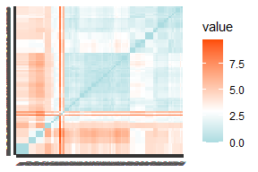
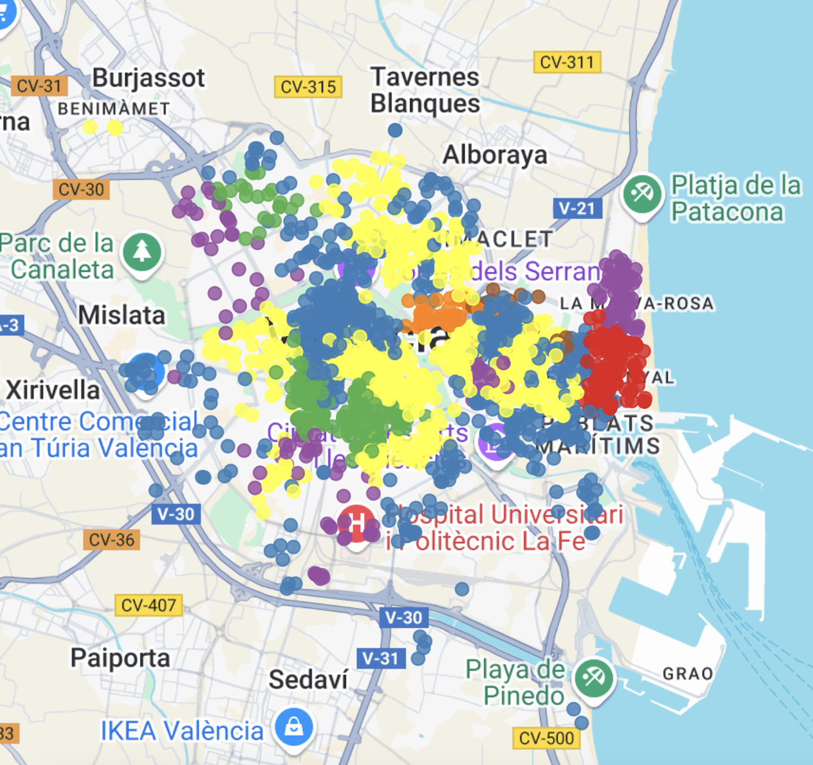

```{r setup, include=FALSE}
knitr::opts_chunk$set(echo = FALSE, warning = FALSE, message = FALSE)
```


```{r librerias, include=FALSE}
# Librerías generales
library(readxl)
library(knitr)
library(gridExtra)
library(dplyr)
library(ggplot2)
library(patchwork)
library(grid)

# Librerías específicas
library(FactoMineR)    # PCA, Clustering, AFC
library(factoextra)    # PCA, Clustering, AFC
library(cluster)       # Clustering
library(NbClust)       # Clustering
library(clValid)       # Clustering
library(ggsci)         # Clustering
library(xtable)        # Clustering
library(corrplot)      # AFC
library(tidyr)         # Reglas de Asociación
library(purrr)         # Reglas de Asociación
library(arules)        # Reglas de Asociación
library(arulesViz)     # Reglas de Asociación
library(viridis)       # PLS-DA, PLS
library(ropls)         # PLS-DA, PLS
library(mixOmics)      # PLS-DA
library(ggrepel)       # PLS-DA, PLS
library(pROC)          # PLS-DA

# Instalación adicional
#if (!requireNamespace("BiocManager", quietly = TRUE)) {
   # install.packages("BiocManager")
#}

#BiocManager::install("mixOmics")
```

# Introducción.
Nuestro conjunto de datos está compuesto por 1867 observaciones; representando cada 
una de ellas un inmueble en alquiler en la ciudad de Valencia, con sus rasgos característicos. En total, cuenta con 44 variables como el precio del alquiler de la vivienda, sus habitaciones, donde esta localizada, servicios de la zona...
 
La fuente principal del estudio ha sido el web scraping a la plataforma Fotocasa, filtrando únicamente las ofertas localizadas en el municipio de Valencia. 
  
Y el objetivo principal del estudio es analizar y predecir el precio del alquiler en Valencia en función de sus características y ubicación, además de estudiar qué relación existe entre las diferentes variables y agrupar las viviendas en bloques según sus características.

Para ello, emplearemos distintas técnicas de análisis descriptivo y predictivo.

# Análisis por componentes principales: PCA.

Como primer paso para analizar los datos que obtuvimos a través de la web de Fotocasa, realizamos un análisis de componentes principales (PCA). El objetivo era reducir la dimensionalidad del conjunto de datos de viviendas (manteniendo la mayor varianza posible en los datos) e identificar patrones o tendencias comunes en las características de los inmuebles ofertados.

```{r, echo=FALSE, warning=FALSE}
fotocasa = read_excel("fotocasaImp.xlsx")
fotocasa <- as.data.frame(fotocasa)

rownames(fotocasa) <- fotocasa[[1]]
variables <- fotocasa[, c(9,10,11,14,15,16,17,18,19,21,22,23,24,25,26,27,28,29,30,31, 32, 33)]
cluster_serv <- read.csv("cluster.csv")
fotocasa$cluster_serv <- cluster_serv$cluster
fotocasa$cluster_serv <- factor(fotocasa$cluster_serv,
                                 levels = c(1, 2, 3, 4, 5, 6, 7),
                                 labels = c("Poblats marítims", "Centro historico-Pedanias-Z. universitaria", "Ruzafa-Jesus-Benicalap", "Periferia", "Aragón-Blasco Íbañez", "Gran Vía-Colón-Z. universitaria","Tarongers"))
```
Para la realización del PCA seleccionamos de nuestra base de datos 22 variables: 2 de ellas categóricas ordinales, 4 binarias y el resto numéricas.
Nuestra variable a predecir es "priceAmount" por lo que la tratamos como variable suplementaria para el PCA, es decir, no interviene en la creación de las componentes principales, pero sí se proyecta sobre ellas para ver que variables están relacionadas con ella positivamente, cuales lo estan negativamente y cuales no tienen relación.

Una vez seleccionadas las variables, procedimos a centrarlas para que el algoritmo identificase correctamente las direcciones de mayor variabilidad partiendo de un centro común (el origen). También las estandarizamos, debido a que estaban medidas en distintas unidades (como metros cuadrados, unidades, etc.). Con esta estandarización nos aseguramos que todas las variables tuvieran el mismo peso en el análisis, y evitar así que aquellas con magnitudes numéricas mayores influyeran de forma desproporcionada en la construcción de las componentes principales.

Seguidamente analizamos la varianza explicada por cada una de las componentes principales para seleccionar el número de componentes más adecuado.

```{r, echo=FALSE,warning=FALSE,message=FALSE,fig.width=4, fig.height=3,fig.align='center'}
res.pca = PCA(variables, scale.unit = TRUE, graph = FALSE, ncp = 10, quanti.sup=21)
eig.val <- get_eigenvalue(res.pca)
VPmedio = 100 * (1/nrow(eig.val))
fviz_eig(res.pca,barfill = "pink",addlabels=TRUE, barcolor = "black",ggtheme = theme_minimal(base_size = 4)) +
  geom_hline(yintercept=VPmedio, linetype=2, color="red")+
  theme_minimal(base_size = 8) +ggtitle(NULL)
```

Como resultado vimos que empleando este método (varianza explicada acumulada), con 8 componentes conseguíamos explicar el 72% de la variabilidad total de nuestros datos, sin embargo, seleccionar 8 componentes complicaría excesivamente la interpretación de los resultados, por lo que decidimos estudiar otros criterios para seleccionar el número de componentes adecuado. Empleamos el método del codo, y obtuvimos que podríamos seleccionar 4 componentes principales, por tanto nos quedamos con esta última cifra para posteriormente facilitar el análisis de los resultados.

## Análisis de atípicos.
Tras la seleccion de componentes, procedimos a evaluar primeramente la presencia de observaciones atípicas extremas dentro del espacio generado por las componentes principales. Para ello, utilizamos el estadístico T² de Hotelling, que nos permitió medir la distancia de cada observación al centro de la nube de puntos proyectada sobre las primeras 4 componentes. 
Seguidamente realizamos también un gráfico de distancia al modelo, basado en la Suma de Cuadrados de los Residuos (SCR). El objetivo en en este caso era identificar atípicos moderados, es decir, aquellos inmuebles cuyas características no estaban siendo capturadas adecuadamente por las componentes principales seleccionadas. 
Tras detectar, en cada caso, las observaciones que tenían una T² de Hotelling o una SCR superior al límite establecido, seleccionamos la observación con la T² de Hotelling más alta, y una observación detectada como atípico moderado.
Analizamos las contribuciones individuales de cada variable a sus altos valores y obtuvimos que por un lado, en el caso del atípico extremo, se debia a que era un ático de lujo en Valencia, por lo que tenía un número elevado de superficie,baños y habitaciones. Y por otro lado, en el caso del atípico moderado, se debía a que el inmueble estaba localizado en una zona con un número elevado de universidades cerca. 
Por tanto, se asumió que el resto de observaciones con distancias elevadas no se correpondian a errores de codificación ni valores anómalos injustificados, sino que respondían a casos reales y válidos. Por ello, no se consideró necesario excluirlas del análisis, ya que la técnica de PCA captura las tendencias generales del conjunto, pero es esperable que algunas viviendas reales, aunque menos frecuentes, se representen peor o no tengan valores similares al resto.
Manteniendo estas observaciones podemos reflejar con mayor fidelidad la diversidad y complejidad del mercado inmobiliario analizado.Todos los gráficos respectivos al análisis de atípicos esta en el \ref{sec:atipicos}.

## Interpretación.
Como primer paso en la interpretación del PCA, analizamos la contribución de cada variable a las cuatro primeras componentes principales. 
Para ello, generamos gráficos de barras que muestran el porcentaje de contribución de cada variable a las dimensiones 1, 2, 3 y 4, eliminando variables que no tienen gran peso en la componente, para así visualizar mejor la información que nos interesa (Gráficos Dim3 y Dim4 en \ref{sec:contribuciones}).

```{r contribucion_variables_patchwork,fig.align='center',echo=FALSE, fig.width=6.5, fig.height=3,message=FALSE, warning=FALSE}
g1 <- fviz_contrib(res.pca, choice = "var", axes = 1, fill = "darkred", color = "black",top=6)
g2 <- fviz_contrib(res.pca, choice = "var", axes = 2, fill = "darkred", color = "black",top=6)
#g3 <- fviz_contrib(res.pca, choice = "var", axes = 3, fill = "darkred", color = "black",top=7)
#g4 <- fviz_contrib(res.pca, choice = "var", axes = 4, fill = "darkred", color = "black",top=7)

grid.arrange(g1, g2, ncol = 2)
```
A partir de los resultados obtenidos extrajimos las siguientes conclusiones:

• **Dimensión 1:** dominada por variables relacionadas con el entorno y la oferta de servicios (como propertyCounter_buy, college_count, pharmacy_count, propertyCounter_rent, etc.), lo cual sugiere que esta componente resume principalmente la accesibilidad y densidad de servicios en la zona.

• **Dimensión 2:** captura características físicas del inmueble, como surface, bathrooms, rooms, y también la presencia de ascensor (tieneAscensor). Esta dimensión parece asociada al tamaño y equipamiento de las viviendas.

• **Dimensión 3:** marcada por environmentImpactRatingType, energyEfficiencyRatingType, así como priceDescription_buy y priceDescription_rent. Aquí vemos que esta dimensión recoge información relativa a aspectos energéticos y al precio de las viviendas.

• **Dimensión 4:** vuelve a resaltar variables como priceDescription_buy, priceDescription_rent, junto con tieneAireAcondicionado o college_count. Esta dimensión podría reflejar un eje entre características de confort del inmueble y variables de contexto económico/educativo.


Para reforzar la información obtenida del gráfico de contribuciones a cada componente principal generamos varios gráficos donde se muestran las variables proyectadas sobre las diferentes componentes principales. Concretamente, representamos los planos formados por las combinaciones de componentes (1,2) y (3,4). Para una mejor visualización hemos proyectado solo las 10 y 6 variables que más contribuían a la formación de los respectivos ejes.


```{r pca_var_combinado, echo=FALSE, fig.width=6, fig.height=3,fig.align='center'}
# Nombre de la variable suplementaria
nombre_sup <- colnames(variables)[21]
sup_coords <- res.pca$quanti.sup$coord
rownames(sup_coords) <- nombre_sup

# Componentes 1 y 2
g1 <- fviz_pca_var(res.pca, axes = c(1, 2), 
                   select.var = list(contrib = 10), repel = TRUE,
                   col.var = "contrib",
                   gradient.cols = c("#00AFBB", "#E7B800", "#FC4E07")) +
  annotate("segment", x = 0, y = 0,
           xend = sup_coords[1], yend = sup_coords[2],
           arrow = arrow(length = unit(0.2, "cm")), color = "blue") +
  annotate("text", x = sup_coords[1], y = sup_coords[2],
           label = rownames(sup_coords), color = "blue", size = 3, vjust = -1) +
  theme_minimal(base_size = 7)

# Componentes 3 y 4
g2 <- fviz_pca_var(res.pca, axes = c(3,4),
                   select.var = list(contrib = 6), repel = TRUE,
                   col.var = "contrib",
                   gradient.cols = c("#00AFBB", "#E7B800", "#FC4E07")) +
  annotate("segment", x = 0, y = 0,
           xend = sup_coords[3], yend = sup_coords[4],
           arrow = arrow(length = unit(0.2, "cm")), color = "blue") +
  annotate("text", x = sup_coords[3], y = sup_coords[4],
           label = rownames(sup_coords), color = "blue", size = 3, vjust = -1) +
  theme_minimal(base_size = 7)

# Mostrar ambos gráficos
grid.arrange(g1, g2, ncol = 2)
```
En estos gráficos, cada flecha representa una variable, y su dirección e intensidad nos indican cómo contribuye a la componente correspondiente. Cuanto más larga y más cálido es el color (como naranja o rojo), más relevante es esa variable para definir el eje.

Por ejemplo, en el plano (1,2), vemos claramente que variables como "surface", "rooms" o "bathrooms" tienen mucho peso sobre la Dim2 y están correlacionadas entre si, lo que tiene sentido porque están muy relacionadas con las características físicas del inmueble, además también vemos como variables como "college_count", "supermarket_count" y "pharmacy_count" también están correlacionadas entre si y tienen un gran peso sobre la Dim1, lo que es coherente con lo dicho anteriormente (que la dimensión 1 resumía principalmente la accesibilidad y densidad de servicios en la zona), es decir, si en una zona hay muchos supermercados, habrá muchas farmacias, colegios,etc.
Por otro lado, vemos como en los planos (3,4), en el eje de la Dim3, "environmentImpactRatingType" y "energyEfficiencyRatingType" estan correlacionadas positivamente, al igual que "priceDescription_buy" y "priceDescription_rent", y a su vez están correlacionadas negativamente entre ellas. Esto nos indica que pisos con menor tasa de contaminación y consumo, tienen mayores precios. Por otro lado, en la Dim4, vemos como pisos en zonas con servicios como colegios o supermercados, tienden ligeramente a tener un menor precio y menor consumo.
Además cabe mencionar de nuevo que la variable "priceAmount" la proyectamos como auxiliar, de esta forma se ve como esta relacionada con el resto de variables sin influir en la creación de las componentes. En este caso que comentábamos se ve claramente que a más superficie, baños y habitaciones claramente más precio, y en el segundo gráfico se comporta como las variables "priceDescription_buy" y "priceDescription_rent", lo que confirma que a menor consumo y contaminación mayor precio.


Hasta ahora no habíamos representado los scores (cada inmueble) en el espacio de componentes principales, ya que al tener tantas observaciones no podíamos interpretarlo fácilmente. Para tratar de distinguir tipos de inmuebles por sus características barajamos la opción de resaltar los scores según al barrio de Valencia al que perteneciesen, pero al ser mas de 10 no se distinguían fácilmente. Por todo esto, tras la explicación del clustering realizado a nuestros datos, completaremos el PCA coloreando los inmuebles en el espacio generado por las componentes principales según al cluster al que pertenezcan.

# Clustering.

Con el objetivo de identificar patrones relevantes dentro de la base de datos, se han planteado dos análisis de clustering independientes. Esta técnica de aprendizaje no supervisado permite agrupar inmuebles en función de sus similitudes, sin necesidad de una variable respuesta.
Para comenzar la exploración, seleccionamos dos grupos de variables para construir nuestros nuevos conjuntos:
  Clustering de Confort (dimensión interna), enfocado en las condiciones de comodidad y habitabilidad que ofrece la propia vivienda.
  Clustering de Servicios (dimensión externa), refleja la calidad, accesibilidad y otras características del entorno urbano del inmueble.
  
```{r tabla, results='asis', fig.align='center'}
fotocasa = read_excel("fotocasaImp.xlsx")
# Vector con nombres de todas las columnas
columnas= colnames(fotocasa)
# Definir las variables de confort
confort = c("tieneAscensor", "tieneTrastero", "tieneCalefaccion", "tieneAireAcondicionado", "bathrooms", "surface", "rooms"
)
# Identificar automáticamente las variables de servicios (aquellas que terminan en "_count")
servicios=c(grep("_count$", columnas, value = TRUE))
# Crear el data.frame de flags
tabla <- data.frame(
  Variable   = columnas,
  Confort    = as.integer(columnas %in% confort),
  Servicios  = as.integer(columnas %in% servicios),
  stringsAsFactors = FALSE
)
# Mostrar resultado
# Filtrar la tabla para conservar solo las filas con al menos un 1 en Confort o Servicios
tabla_filtrada <- tabla[rowSums(tabla[, c("Confort", "Servicios")]) > 0, ]
# Mostrar resultado

# Luego imprimir con xtable (permitiendo LaTeX en encabezados)
print(xtable(tabla_filtrada), 
      type = "latex", 
      comment = FALSE,  
      include.rownames = FALSE,
      sanitize.colnames.function = identity)

```
Sin embargo, debido a limitaciones de espacio, en la memoria principal se ha optado por incluir únicamente el clustering basado en los servicios de la ubicación. Hemos priorizado esta división antes que la de confort y comodidad porque consideramos que sus resultados muestran una estructura de agrupamiento más clara y relevante. Además, la clasificación solventa uno de los problemas de la base de datos original: el exceso de barrios y municipios que no permitía un análisis correcto del entorno urbano.
Así pues, dado que las conclusiones de esta fase del proyecto serán incorporados en estudios posteriores; creemos que su inclusión en la memoria final es imprescindible.
No obstante, la clasificación en función del confort está disponible en el anexo \ref{sec:confort}; en caso de que se quiera consultar.

## Clustering de servicios del entorno.

El paso previo a la clasificación fue comprobar si existían tendencias de agrupación en los pisos basándonos en las variables del cluster. Para ello, elaboramos un *heatmap*. Dado que pretendíamos identificar similitudes entre las infraestructuras ofrecidas por cada ubicación, consideramos adecuado aplicar una medida de cercanía.
Probamos todas las distancias para variables numéricas disponibles y, finalmente, obtuvimos una tendencia de agrupación más compacta con la euclídea.
En el mapa resultante, se observan ciertos subgrupos alrededor de la diagonal principal; aunque sería necesario efectuar el clustering para identificar estructuras más claras.

.
```{r heatmap, fig.align='center', out.width="50%"}
fotocasaServicios = fotocasa[,tabla$Servicios == 1]
fotocasaServiciosCE = scale(fotocasaServicios, center = TRUE, scale = TRUE)
midist_eu <- get_dist(fotocasaServiciosCE, stand = FALSE, method = "euclidean")
#fviz_dist(midist_eu, show_labels = TRUE, lab_size = 0.3,
          #gradient = list(low = "#00AFBB", mid = "white", high = "#FC4E07"))

```

Como punto de partida, iniciamos el análisis probando varias técnicas de agrupamiento: el método jerárquico de Ward y los de partición k-medias y k-medioides. En los tres casos, analizamos simultáneamente la suma de cuadrados residual y el coeficiente de Silhouette para determinar el número óptimo de subgrupos.
Así, seleccionamos k=6 con Ward; k=8 mediante PAM y k=7 aplicando k-medias.
Una vez divididos los datos, comparamos el coeficiente medio de Silhouette y vimos que, en los grupos obtenidos a partir de las medias, la mayoría de los grupos estaban mejor definidos. Por ello, nos decantamos por los 7 clusters.
Los gráficos relativos a la selección del método de agrupación no se han incluido en la memoria final, pero se pueden consultar en el anexo \ref{sec:clusteringDistancias}.

```{r k_medias, include=FALSE}
p1 = fviz_nbclust(x = fotocasaServicios, FUNcluster = kmeans, method = "silhouette",
             k.max = 10, verbose = FALSE) +
  labs(title = "Numero optimo de clusters")
p2 = fviz_nbclust(x = fotocasaServicios, FUNcluster = kmeans, method = "wss",
             k.max = 10, verbose = FALSE) +
  labs(title = "Numero optimo de clusters")
grid.arrange(p1, p2, nrow = 1)
```

```{r comparacion, include=FALSE}
clustWARD <- hclust(midist_eu, method="ward.D2")
gruposWARD <- cutree(clustWARD, k=6)
clustPAM <- pam(midist_eu, k =8, diss=TRUE)
set.seed(100)
clustMEANS <- kmeans(fotocasaServiciosCE, centers = 7, nstart = 20)
colores = pal_npg("nrc")(6)
colores2 = pal_npg("nrc")(8)
colores3=pal_npg("nrc")(7)
par(mfrow = c(1,3))
plot(silhouette(gruposWARD, midist_eu), col=colores, border=NA, main = "WARD")
plot(silhouette(clustPAM$clustering, midist_eu), col=colores2, border=NA, main = "K-MEDIOIDES")
plot(silhouette(clustMEANS$cluster, midist_eu), col=colores3, border=NA, main = "K-MEDIAS")
fotocasaServicios$cluster=clustMEANS$cluster

```

A continuación, estudiamos qué variables habían tenido más peso en la nueva clasificación a través de un Análisis de Componentes Principales con 2 dimensiones. Asimismo, utilizamos las columnas cluster y priceAmount como auxiliares para entender su relación con el resto de variables consideradas.

```{r fig.align='center', fig.height=3, fig.width=4, include=FALSE}
fotocasaServicios$cluster=factor(fotocasaServicios$cluster)
fotocasaServicios$priceAmount=fotocasa$priceAmount
miPCA2 = PCA(fotocasaServicios, scale.unit = TRUE, graph = FALSE, ncp=2, quanti.sup="priceAmount", quali.sup="cluster")
eig.val = get_eigenvalue(miPCA2)
Vmedia = 100 * (1/nrow(eig.val))
fviz_eig(miPCA2, addlabels = TRUE) +
  geom_hline(yintercept=Vmedia, linetype=2, color="red")
```

Al estudiar el score plot, identificamos siete grupos claramente diferenciados. Destacan especialmente los clusters 7 y 1, tan compactos que apenas se distinguen uno o dos individuos. Incluso en las divisiones más dispersas (3 y 4) sus puntos se encuentran bastante próximos.
Por otra parte, en el loading plot se aprecia que la primera componente está positivamente relacionada con la cantidad de farmacias, colegios, supermercados y conexiones de transporte. En cambio, la segunda depende de los hospitales y universidades. No parece que el precio del piso tenga una gran importancia en esta clasificación.
Paralelamente, si suporponemos ambos gráficos, parece que el cluster 3 sobresale por estar notablemente mejor comunicado que el resto de grupos. Por el contrario, el cluster 2 es aparentemente el peor ubicado.
```{r pcaPLOTS, fig.align='center', fig.height=3, fig.width=7}
p1 <- fviz_pca_ind(miPCA2,
                   geom = "point",
                   habillage = fotocasaServicios$cluster,
                   palette = "jco",
                   title = "Score plot: individuos")
# Loading plot (variables activas)
p2 <- fviz_pca_var(miPCA2,
                   col.var = "contrib", # Color según contribución a los ejes,
                   col.quanti.sup = 'black',
                   gradient.cols = c("#00AFBB", "#E7B800", "#FC4E07"),
                   repel = TRUE,
                   title = "Loading plot: variables")
# Mostrar ambos juntos
grid.arrange(p1, p2, nrow = 1)
```
Para comparar los precios de cada cluster, calculamos sus medias y representamos las 7 distribuciones mediante sus respectivos gráficos de caja y bigotes. Tal como habíamos supuesto al examinar el PCA, no encontramos una diferencia muy acusada entre los precios medios. No obstante, resulta sorprendente que el cluster 2, que habiamos resaltado como el peor ubicado, es el más caro en promedio. Este importe elevado seguramente se deba a los pisos atípicos detectados en su *box&whiskers*, los cuales podrían estar mal clasificados o reflejar una ubicación segmentada internamente entre viviendas básicas y otras más exclusivas.
El tercer cluster tiene un precio muy similar, aunque con menos pisos atípicos, por lo que seguramente sus viviendas presenten buena comunicación general.

```{r mediasServicios, fig.align='center', fig.height=2.2, fig.width=6}
price_por_cluster <- aggregate(priceAmount ~ fotocasaServicios$cluster, data = fotocasa, mean)
colnames(price_por_cluster) <- c("Clúster", "Precio medio (€)")
rownames(price_por_cluster) <- NULL
tabla_grob <- tableGrob(price_por_cluster, rows = NULL)

# Cambiar el tamaño de letra en todas las celdas
tabla_grob$grobs <- lapply(tabla_grob$grobs, function(g) {
  if ("text" %in% class(g)) {
    g$gp <- gpar(fontsize = 8)  # Aquí ajustas el tamaño
  }
  g
})

# Crear boxplot con ggplot
df <- data.frame(cluster = factor(fotocasaServicios$cluster), price = fotocasa$priceAmount)
boxplot_grob <- ggplot(df, aes(x = cluster, y = price)) +
  geom_boxplot(fill = "lightblue") +
  ylim(0, 5000) +
  labs(title = "Distribución del precio por clúster", 
       x = "Clúster", 
       y = "Precio (€)") +
  theme_minimal() +
  theme(plot.title = element_text(size = 8))  # Ajusta aquí el tamaño del título

# Mostrar ambos juntos
grid.arrange(tabla_grob, boxplot_grob, ncol = 2)

```

### Representación de los clusters en la ciudad de Valencia.
Finalmente, para visualizar geográficamente los resultados obtenidos, hemos los 7 clusters en un mapa de la ciudad de Valencia, utilizando las variables latitud y longitud. Así, fue posible determinar a qué zona corresponde cada uno de los grupos.
La representación del mapa la conseguimos a partir de una API KEY de google cloud y, por motivos de seguridad, en esta memoria se incluirá en formato png. En la imagen se aprecia como, mientras algunos clusters están muy centrados en una zona concreta, otros se extienden por varios barrios valencianos.

```{r fig.align='center', out.width="0.3\\linewidth"}

```

A partir de la información obtenida en el mapa, hemos diseñado la siguiente clasificación:

```{r clasificacion_final, fig.align='center', fig.height=1.5, fig.width=7}
# Datos base
clasificacion <- data.frame(
  Cluster = paste("Clúster", 1:7),
  Zona = c(
    "Poblats Marítims",
    "Centro histórico, pedanías y zona universitaria",
    "Ruzafa, Jesús y Benicalap",
    "Periferia",
    "Aragón, Blasco Ibáñez",
    "Gran Vía, Colón y zona universitaria",
    "Tarongers"
  ),
  Color = c("#E41A1C", "#377EB8", "#4DAF4A", "#984EA3", "#FF7F00", "#FFFF33", "#A65628")
)

# Extraer número de clúster para ordenar
clasificacion$Num <- as.numeric(gsub("[^0-9]", "", clasificacion$Cluster))

# Ordenar por número de clúster
clasificacion <- clasificacion[order(clasificacion$Num), ]

# Crear gráfico con orden correcto
ggplot(clasificacion, aes(x = 1, y = factor(Zona, levels = rev(Zona)), fill = Cluster)) +
  geom_tile(width = 0.8, height = 0.8, show.legend = FALSE) +
  geom_text(aes(label = Cluster), color = "white", fontface = "bold", size = 4) +
  geom_text(aes(x = 2, label = Zona), color = "black", hjust = 0, size = 4) +
  scale_fill_manual(values = clasificacion$Color) +
  theme_void() +
  coord_cartesian(clip = "off") +
  xlim(0.5, 3.5)

```
# Uso del Clustering para completar el PCA.

En este punto, podemos aplicar las conclusiones extraídas del análisis a zonas reales y conocidas de nuestra ciudad. Utilizaremos estas agrupaciones para colorear en el PCA realizado anteriormente.

```{r biplots_pca_pequeños, echo=FALSE,fig.width=8, fig.height=4,fig.align='center'}
cluster_serv <- read.csv("cluster.csv")
fotocasa$cluster_serv <- cluster_serv$cluster
fotocasa$cluster_serv <- factor(fotocasa$cluster_serv,
                                 levels = c(1, 2, 3, 4, 5, 6, 7),
                                 labels = c("Poblats marítims", "Centro historico-Pedanias-Z. universitaria", "Ruzafa-Jesus-Benicalap", "Periferia", "Aragón-Blasco Íbañez", "Gran Vía-Colón-Z. universitaria","Tarongers"))

g1 <- fviz_pca_biplot(res.pca, axes = c(1, 2), repel = TRUE,select.var = list(contrib = 15),
                      col.ind = fotocasa$cluster_serv,
                      col.var = "black",
                      label = "var",
                      pointsize = 0.8) +   # puntos más pequeños
  labs(title = "PCA: 1 vs 2") +
  theme_minimal(base_size = 9) 

g3 <- fviz_pca_biplot(res.pca, axes = c(1,3), repel = TRUE,select.var = list(contrib = 15),
                      col.ind = fotocasa$cluster_serv,
                      col.var = "black",
                      label = "var",
                      pointsize = 0.8) +
  labs(title = "PCA: 1 vs 3") +
  theme_minimal(base_size = 9)
g1
#g3

#grid.arrange(g1, g2, ncol = 2)

```

Tras comparar los anteriores gráficos con el mapa de Valencia, y ver a que zona pertenece cada grupo, extrajimos las siguientes conclusiones:

**-> Poblats marítims:** Es una zona bien comunicada, con buena oferta de propiedades, alta presencia de supermercados, transporte público, y cercanía a colegios.
Parece un entorno atractivo para jóvenes y estudiantes, donde la movilidad y el acceso a servicios básicos son clave, o también para estancias vacacionales, porque esta cerca del puerto y la playa.
Puede tener precios de alquiler más reducidos, pero no destacan por la amplitud o el número de baños. 

**-> Centro histórico-pedanías.Z. universitaria:**representa una zona heterogénea: comparte una escasa accesibilidad a servicios urbanos, pero muestra gran variabilidad en cuanto al tamaño, equipamiento y precio de las viviendas. Algunas áreas pueden ofrecer viviendas espaciosas con ascensor, calefacción y a un precio mayor, mientras que otras tienen una oferta más básica. Esta diversidad podría explicarse por la mezcla entre áreas más históricas, otras más funcionales (posiblemente vinculadas al entorno universitario) y otras alejadas de la ciudad.

**-> Ruzafa-Jesus-Benicalap:**Zonas urbanas bien conectadas y con abundantes servicios (supermercados, transporte, farmacias). Aunque en general las viviendas no destacan por su tamaño, en algunas subzonas del grupo sí hay inmuebles amplios y bien equipados. Son áreas atractivas para quienes valoran el entorno y la accesibilidad, sin descuidar del todo el confort del hogar.

**-> Perfiferia:**Es una zona heterogénea. En áreas cercanas a universidades se encuentran viviendas más amplias y equipadas, mientras que en otras zonas, con mejor acceso a servicios y transporte, predominan inmuebles más pequeños.

**-> Aragón-Blasco Íbañez:**Zonas funcionales con viviendas medianas o amplias y bien equipadas. Aunque no destacan por sus servicios, su cercanía a áreas universitarias y buena eficiencia energética las hace atractivas para jóvenes y familias que valoran el espacio y la ubicación, incluso a un coste algo mayor.

**-> Gran Vía-Colón-Z.universitaria:**representa zonas variadas: algunas con buenos servicios y precios altos, pero viviendas pequeñas; otras, cercanas a universidades, con más espacio y mejor equipamiento, aunque con menos servicios. En general, combina ubicaciones atractivas con viviendas heterogéneas, ideales para quienes priorizan la localización.

**-> Tarongers:**vinculado al entorno universitario. Zonas donde las viviendas ofrecen un adecuado tamaño y confort, y con excelente acceso a centros educativos aunque no a tantos servicios. Son áreas preferidas por estudiantes o jóvenes que buscan funcionalidad a buen precio.

En conjunto, los resultados del clustering muestran una segmentación coherente con la estructura urbana y social de la ciudad, reflejando patrones territoriales que se corresponden con zonas reales y reconocibles. Esta clasificación no solo valida la calidad del análisis, sino que también permite incorporar de forma explícita la dimensión del entorno como variable explicativa en análisis posteriores; mejorando así nuestro entendimiento del mercado inmobiliario valenciano.


```{r adjuntar_cluster}
# Supón que quieres copiar la columna "mi_columna" del dataframe df1
write.csv(fotocasaServicios["cluster"], "cluster.csv", row.names = FALSE)

```

```{r datos, include=FALSE}
afc_fotocasa = read_excel("data_clean1.xlsx")
```

# AFC simple: Subtipo y Precio
Además de este AFC simple se ha realizado también otro AFC con las variables Municipio y Precio, sin embargo como el clustering aporta más información que el AFC sobre dichas variables se ha decidido dejarlo en Anexos (\ref{sec:afc_muni_precio}) como consulta en lugar de presentarlo en el proyecto.

A continuación, se analizan los resultados del Análisis de Correspondencias (AFC) realizado entre el tipo de vivienda y el rango de precios. Este análisis permite identificar patrones entre distintas categorías de vivienda (como áticos o pisos) y los niveles de precio en los que suelen encontrarse. Por esta razón, se ha optado por aplicar un AFC a estas variables.

La justificación detallada del análisis, así como su desarrollo completo, se encuentra en el apartado de Anexos (véase \ref{sec:afc_tipo_precio}). En los gráficos siguientes, la interpretación se centrará exclusivamente en el eje horizontal, dado que este representa el mayor porcentaje de variabilidad explicada (83,3%). En consecuencia, la posición en el eje vertical (Dim2) no será tenida en cuenta en esta lectura.

```{r map_subtipo_mem, include=FALSE}
# Diccionario para traducir los códigos de propertySubtypeId a nombres descriptivos
subtype_map <- c("1" = "Piso",
                 "2" = "Apartamento",
                 "3" = "Casa o chalet",
                 "5" = "Casa adosada",
                 "6" = "Ático",
                 "7" = "Dúplex",
                 "8" = "Loft",
                 "52" = "Bajos",
                 "54" = "Estudio",
                 "10" = "Otros")
# Aplicar el mapeo
afc_fotocasa$propertySubtypeCat <- subtype_map[as.character(afc_fotocasa$propertySubtypeId)]
```

```{r trans_precio_mem, include=FALSE}
# Crear categorías ordinales de precio con cuantiles
afc_fotocasa$priceCategory <- cut(afc_fotocasa$priceAmount,
                                  breaks = quantile(afc_fotocasa$priceAmount, probs = seq(0, 1, length.out = 7), na.rm = TRUE),
                                  include.lowest = TRUE,
                                  labels = c("Muy Bajo", "Bajo", "Medio Bajo", "Medio Alto", "Alto", "Muy Alto")
                                  )
```

```{r, echo=FALSE,include=FALSE}
# Tabla de contingencia Subtipo vs Categoría de Precio
tabla_subtipo_precio <- table(afc_fotocasa$propertySubtypeCat, afc_fotocasa$priceCategory)
# Mostrar tabla
tabla_subtipo_precio
# Test Chi-cuadrado para evaluar independencia
chisq.test(tabla_subtipo_precio, simulate.p.value = TRUE)
```

```{r, include=FALSE}
afc_subtipo = CA(tabla_subtipo_precio, graph = FALSE)
# Inercia explicada por dimensión
valores_propios_subtipo = get_eigenvalue(afc_subtipo)
# Inercia media
inercia_media_subtipo = 100 * (1 / nrow(valores_propios_subtipo))
# Gráfico de varianza explicada
fviz_eig(afc_subtipo, addlabels = TRUE) +
  geom_hline(yintercept = inercia_media_subtipo, linetype = 2, color = "red") +
  ggtitle("Varianza Explicada por Componente")
```

```{r, echo=FALSE, fig.align='center', fig.height=2, fig.width=6.5}
# Análisis de correspondencias
afc_subtipo = CA(tabla_subtipo_precio, graph = FALSE, ncp = 2)

# Gráfico de subtipos de vivienda
g1 <- fviz_ca_row(afc_subtipo, axes = c(1, 2), repel = TRUE,
                  col.row = "contrib",
                  gradient.cols = c("#00AFBB", "#E7B800", "#FC4E07"),
                  title = "Subtipos de Vivienda")

# Gráfico de categorías de precio
g2 <- fviz_ca_col(afc_subtipo, axes = c(1, 2), repel = TRUE,
                  col.col = "contrib",
                  gradient.cols = c("#00AFBB", "#E7B800", "#FC4E07"),
                  title = "Categorías de Precio")

# Mostrar ambos juntos
grid.arrange(g1, g2, ncol = 2)
```
Al interpretar ambos gráficos conjuntamente, y centrándonos exclusivamente en la Dimensión 1, se observa un patrón claro y coherente que vincula determinados subtipos de vivienda con categorías específicas de precios. Los subtipos más exclusivos, como el "Ático", se alinean con las categorías más altas de precio, mientras que las categorías de precio más bajo se asocian con subtipos menos definidos o de menor valor. Esta estructura evidencia la existencia de una dimensión principal que organiza las relaciones entre tipo de vivienda y nivel de precios, permitiendo una interpretación robusta del mercado residencial en función de estas variables. La correspondencia entre ambos conjuntos de categorías es clara, especialmente porque la proyección de filas y columnas sobre el eje principal se refleja de manera simétrica.

# Reglas de Asociación.

Con el objetivo de facilitar el análisis de reglas de asociación, se realizó una transformación de las variables de la base de datos. Las variables numéricas `precio` y `superficie` se agruparon en cuartiles, generando variables categóricas como "precio_bajo" o "superficie_alta". Asimismo, se transformaron variables booleanas en etiquetas comprensibles (por ejemplo, `tieneAscensor = 1` se convierte en `"con_ascensor"`).

Una vez procesados los datos, se aplicó el algoritmo **Apriori** con un umbral mínimo de soporte del 1% y confianza del 50% obteniendo un total de 12745 reglas. Posteriormente se han eliminado reglas redundantes, esto permite conservar las reglas más significativas. Las reglas maximales no se han priorizado, ya que suelen perder especificidad, dificultando su aplicación práctica. Tras eliminar las redundantes nos quedamos con un total de 2408 reglas. Por último, filtramos las reglas con los siguientes umbrales quedándonos con las 21 reglas más relevantes: Soporte > 0.015, Confianza > 0.7 y Lift > 3.5

Estas condiciones permiten identificar patrones **robustos y estadísticamente relevantes** que relacionan ciertas configuraciones de un inmueble con su probabilidad de pertenecer a un rango de precio específico. A continuación se muestran las **cinco reglas más destacadas**, ordenadas por su *lift*. Es importante destacar que las 21 reglas comparten el consecuente de **Precio Alto**.

```{r Preparación de los Datos, include=FALSE}
datosReglas <- read_excel("fotocasaImp.xlsx")

data_variables <- datosReglas %>%
  dplyr::select(URL, bathrooms, rooms, surface, priceAmount,
         tieneAscensor, tieneTrastero, tieneCalefaccion, tieneAireAcondicionado)

# Convertir variables
data_variables$tieneAscensor <- ifelse(data_variables$tieneAscensor == 1, "con_ascensor", "sin_ascensor")
data_variables$tieneTrastero <- ifelse(data_variables$tieneTrastero == 1, "con_trastero", "sin_trastero")
data_variables$tieneCalefaccion <- ifelse(data_variables$tieneCalefaccion == 1, "con_calefaccion", "sin_calefaccion")
data_variables$tieneAireAcondicionado <- ifelse(data_variables$tieneAireAcondicionado == 1, "con_aire", "sin_aire")

data_variables$bathrooms <- dplyr::case_when(
  data_variables$bathrooms == 1 ~ "1_banio",
  data_variables$bathrooms == 2 ~ "2_banios",
  data_variables$bathrooms >= 3 ~ "3+_banios",
  TRUE ~ NA_character_
)

data_variables$rooms <- dplyr::case_when(
  data_variables$rooms == 1 ~ "1_habitacion",
  data_variables$rooms == 2 ~ "2_habitaciones",
  data_variables$rooms == 3 ~ "3_habitaciones",
  data_variables$rooms >= 4 ~ "4+_habitaciones",
  TRUE ~ NA_character_
)

# Crear variable categórica de precio en cuartiles
cuartiles <- ntile(data_variables$priceAmount, 4)
data_variables$priceAmount <- dplyr::case_when(
  cuartiles == 1 ~ "precio_bajo",
  cuartiles == 2 ~ "precio_medio_bajo",
  cuartiles == 3 ~ "precio_medio_alto",
  cuartiles == 4 ~ "precio_alto"
)

# Crear variable categórica de surface en cuartiles
cuartiles_surface <- ntile(data_variables$surface, 3)
data_variables$surface <- dplyr::case_when(
  cuartiles_surface == 1 ~ "surface_bajo",
  cuartiles_surface == 2 ~ "surface_medio",
  cuartiles_surface == 3 ~ "surface_alto"
)

# Convertir a formato largo
datos_largos <- data_variables %>%
  dplyr::select(-URL) %>%  # Elimina columnas no categóricas o redundantes
  mutate_all(as.character) %>%
  mutate(id = row_number()) %>%
  pivot_longer(cols = -id, names_to = "atributo", values_to = "items") %>%
  unite("items", atributo, items, sep = "_")

# Crear tabla binaria
tabla_binaria <- datos_largos %>%
  mutate(valor = 1) %>%
  pivot_wider(names_from = items, values_from = valor, values_fill = 0)

# Convertir a transacciones
transacciones <- as(as.matrix(tabla_binaria[,-1]), "transactions")

reglas <- apriori(transacciones, parameter = list(supp = 0.01, conf = 0.5))
reglas <- reglas[!is.redundant(reglas)]
reglas_filtradas <- subset(reglas, confidence > 0.7 & lift > 3.5 & support > 0.015)

reglas_ordenadas <- sort(reglas_filtradas, by = "lift", decreasing = TRUE)
reglas_df <- as(reglas_ordenadas[1:5], "data.frame")

reglas_filtradas_precio_bajo <- subset(reglas, rhs %in% "priceAmount_precio_bajo" & lift>2.7 & confidence>0.8 & support>0.0107)
reglas_bajas_ordenadas <- sort(reglas_filtradas_precio_bajo, by = "lift", decreasing = TRUE)
reglas_df_bajas <- as(reglas_bajas_ordenadas, "data.frame")
```


```{r Reglas Precio Alto, echo=FALSE, results='asis'}
kable(reglas_df, format = "latex", digits = 3,
      caption = "Reglas de asociación más relevantes (ordenadas por lift)") %>%
  kableExtra::kable_styling(latex_options = c("scale_down", "hold_position"))

```

Dado que dichas reglas están asociadas a precios altos, exploramos ahora aquellas cuya consecuencia es priceAmount = precio_bajo. Este tipo de reglas resulta útil para detectar inmuebles con condiciones objetivas que los hacen significativamente más asequibles. Para ello, filtramos las reglas con: Soporte > 0.0107, Confianza > 0.8 y Lift > 2.7
```{r Reglas Precio Bajo, echo=FALSE, results='asis'}
kable(reglas_df_bajas, format = "latex", digits = 3,
      caption = "Reglas de asociación más relevantes asociadas a Precios Bajos (ordenadas por lift)") %>%
  kableExtra::kable_styling(latex_options = c("scale_down", "hold_position"))
```


Este análisis ha revelado patrones sólidos entre las características de los inmuebles y su rango de precio. En particular, propiedades con gran superficie, múltiples baños y habitaciones, ascensor, calefacción y aire acondicionado muestran una alta probabilidad de pertenecer al segmento de precio alto. En contraste, los inmuebles con superficie reducida, una sola habitación y ausencia de comodidades tienden a asociarse con precios bajos, lo que puede indicar oportunidades de inversión o infravaloración. Además se han creado una serie de gráficos que refuerzan este análisis (consultar en el anexo \ref{sec:reglasasociacion}).


# PLS-DA.

Antes de realizar este análisis, comprobamos que nuestra base de datos no cumplía las condiciones de homocedasticidad ni normalidad (ver en el \ref{sec:fisher}. Esto quiere decir que no podemos aplicar un Análisis Discriminante de Fisher para predecir qué inmuebles serán rebajados.
En su lugar, emplearemos un PLS discriminante; en el que consideraremos como POSITIVOS las viviendas cuyo precio sea menor al precio original. Para ello, hemos convertido la variable primitiva priceAmountDrop en priceDropBinary (0 si el precio baja, 1 si se mantiene estable).
En la primera fase del análisis, seleccionamos la mayoría de variables disponibles (incluyendo el cluster por servicios diseñado en análisis previos); descartando aquellas cuya información resultaba inservible o redundante.
Para evitar el diseño de un modelo sesgado, escalamos las variables numéricas y dividimos los datos en los conjuntos de entrenamiento (70%) y test (30%). Además, realizamos un undersampling en la base de entrenamiento eliminando aleatoriamente parte de los pisos sin bajada de precio; puesto que había un fuerte desbalanceo que podía favorecer sistemáticamente las predicciones de la clase predominante.

```{r seleccion_datos, echo=FALSE, fig.align='center', fig.height=2, fig.width=4}
fotocasa = read_excel("fotocasaImp.xlsx")
fotocasa$priceDropBinary <- ifelse(fotocasa$priceAmountDrop > 0, 1, 0)
cluster_serv <- read.csv("cluster.csv")
fotocasa$cluster <- cluster_serv$cluster
fotocasa_original=fotocasa
# Limpiar y seleccionar variables relevantes (modifica según variables de tu dataset)
fotocasa <- fotocasa[, !(names(fotocasa) %in% c("URL", "lat", "lng", "municipality", "neighborhood", "zipCode", "priceAmountDrop", "creationDate"))]

# Tabla original
tabla_ini <- fotocasa_original %>%
  count(priceDropBinary) %>%
  mutate(Etapa = "Original",
         porcentaje = round(100 * n / sum(n), 1))

# Gráfico original
g1 <- ggplot(tabla_ini, aes(x = as.factor(priceDropBinary), y = n, fill = as.factor(priceDropBinary))) +
  geom_col(width = 0.6) +
  geom_text(aes(label = paste0(porcentaje, "%")), vjust = -0.5, size = 2) +
  scale_fill_manual(values = c("0" = "#6BAED6", "1" = "#FF55C7")) +
  labs(title = "Distribución original",
       x = "Clase (priceDropBinary)", y = "Frecuencia") +
  ylim(0, max(tabla_ini$n) * 1.1) +
  theme_minimal(base_size = 7) +
  theme(legend.position = "none")

# --- División inicial ---
set.seed(456)
train_indices <- sample(1:nrow(fotocasa), size = 0.7 * nrow(fotocasa))
fotocasa_train <- fotocasa[train_indices, ]
fotocasa_test  <- fotocasa[-train_indices, ]

# --- Undersampling SOLO al entrenamiento ---
fotocasa_train_0 <- filter(fotocasa_train, priceDropBinary == 0)
fotocasa_train_1 <- filter(fotocasa_train, priceDropBinary == 1)

n1 <- nrow(fotocasa_train_1)
n0_target <- n1  # misma cantidad que clase 1

set.seed(456)
fotocasa_train_bal <- bind_rows(sample_n(fotocasa_train_0, n0_target), fotocasa_train_1)

# Tabla tras muestreo
tabla_fin <- fotocasa_train_bal %>%
  count(priceDropBinary) %>%
  mutate(Etapa = "Tras muestreo",
         porcentaje = round(100 * n / sum(n), 1))

# Gráfico tras muestreo
g2 <- ggplot(tabla_fin, aes(x = as.factor(priceDropBinary), y = n, fill = as.factor(priceDropBinary))) +
  geom_col(width = 0.6) +
  geom_text(aes(label = paste0(porcentaje, "%")), vjust = -0.5, size =2) +
  scale_fill_manual(values = c("0" = "#6BAED6", "1" = "#FF55C7")) +
  labs(title = "Distribución tras muestreo",
       x = "Clase (priceDropBinary)", y = "Frecuencia") +
  ylim(0, max(tabla_ini$n, tabla_fin$n) * 1.1) +
  theme_minimal(base_size = 7) +
  theme(legend.position = "none")

# --- Combinar para model.matrix ---
fotocasa_train_bal$set <- "train"
fotocasa_test$set <- "test"
fotocasa_both <- bind_rows(fotocasa_train_bal, fotocasa_test)

# Variables como factor
fotocasa_both <- fotocasa_both %>%
  mutate(
    cluster = as.factor(cluster),
    propertySubtypeId = as.factor(propertySubtypeId),
    ownerType = as.factor(ownerType),
    tieneCalefaccion = as.factor(tieneCalefaccion),
    tieneTrastero = as.factor(tieneTrastero),
    tieneAscensor = as.factor(tieneAscensor),
    hotWater = as.factor(hotWater),
    tieneAireAcondicionado = as.factor(tieneAireAcondicionado)
  )


X_data <- dplyr::select(fotocasa_both, -priceDropBinary, -set)

X_all <- model.matrix(~ . - 1, data = X_data) %>% scale()

# Separar nuevamente
X_train <- X_all[fotocasa_both$set == "train", ]
X_test  <- X_all[fotocasa_both$set == "test", ]
Y_train <- as.factor(fotocasa_train_bal$priceDropBinary)
Y_test  <- as.factor(fotocasa_test$priceDropBinary)

# Mostrar gráficos
g1 + g2

```
Seguidamente, propusimos el modelo inicial. Aplicamos la validación cruzada con 5 grupos o folds y 10 repeticiones hasta quedarnos con 1 única componente principal, minimizando así el error de predicción.
Una vez aplicado el modelo al conjunto de test, maximizamos su exactitud balanceada de 0.59 a 0.632 variando el umbral óptimo.
Seleccionamos esta métrica como medida de calidad porque tiene en cuenta los aciertos en ambas clases de pisos (0, 1), sin proporcionar resultados engañosos ni dejarse condicionar por el desbalanceo.
Esta primera versión mostraba una capacidad predictiva aceptable, generando mejores resultados que los que se obtendrían por azar.
Cabe recalcar que la bajada de precio de las viviendas está muy condicionada por el factor humano y las condiciones individuales de cada propietario. Por lo tanto, podríamos considerarla una variable de naturaleza impredecible o, al menos, con un comportamiento difícil de modelar.
A continuación, nos propusimos incrementar la eficacia mediante un test de independencia.
El objetivo era proponer un nuevo modelo formado por las variables que presentaran diferencias significativas entre clases. Así, descartamos la inclusión de variables sin capacidad predictiva, que únicamente generan ruido y disminuyen la fiabilidad de las predicciones.
A las variables numéricas les aplicamos el test t y a las categóricas el test chi-cuadrada o, en caso de muestras pequeñas, la prueba de Fisher. 
Una vez realizada la selección, volvimos a dividir, escalar y reducir la nueva base de datos y generamos el segundo modelo; compuesto nuevamente por una sola componente principal.

```{r test_independencia, echo=FALSE, fig.align='center', fig.height=2, fig.width=4}
fotocasa$cluster <- as.factor(fotocasa$cluster)
fotocasa$ownerType <- as.factor(fotocasa$ownerType)
fotocasa$propertySubtypeId <- as.factor(fotocasa$propertySubtypeId)
fotocasa$tieneCalefaccion = as.factor(fotocasa$tieneCalefaccion)
fotocasa$tieneTrastero = as.factor(fotocasa$tieneTrastero)
fotocasa$tieneAscensor = as.factor(fotocasa$tieneAscensor)
fotocasa$hotWater = as.factor(fotocasa$hotWater)
fotocasa$tieneAireAcondicionado = as.factor(fotocasa$tieneAireAcondicionado)
numeric_vars <- fotocasa %>%
  dplyr::select_if(is.numeric) %>%
  dplyr::select(-priceDropBinary) %>%
  colnames()

t_pvals <- sapply(numeric_vars, function(var) {
  t.test(fotocasa[[var]] ~ fotocasa$priceDropBinary)$p.value
})
low_sig_num <- names(t_pvals[t_pvals > 0.2])

# 2. Variables categóricas: chi-cuadrado o Fisher si es necesario
cat_vars <- fotocasa %>%
  select_if(~ is.factor(.) | is.character(.)) %>%
  colnames()

chi_pvals <- sapply(cat_vars, function(var) {
  tbl <- table(fotocasa[[var]], fotocasa$priceDropBinary)
  if (all(dim(tbl) > 1)) {
    if (any(tbl < 5)) {
      fisher.test(tbl, simulate.p.value = TRUE, B = 2000)$p.value
    } else {
      chisq.test(tbl)$p.value
    }
  } else {
    1  # Si no hay variación
  }
})

low_sig_cat <- names(chi_pvals[chi_pvals > 0.2])

# 3. Unir las variables irrelevantes
vars_to_remove <- union(low_sig_num, low_sig_cat)

# 4. Crear dataset reducido
fotocasa_significativo <- fotocasa[, !(names(fotocasa) %in% vars_to_remove)]

set.seed(456)
train_indices <- sample(1:nrow(fotocasa_significativo), size = 0.7 * nrow(fotocasa_significativo))
fotocasa_train <- fotocasa_significativo[train_indices, ]
fotocasa_test  <- fotocasa_significativo[-train_indices, ]

# --- Undersampling SOLO al entrenamiento ---
fotocasa_train_0 <- filter(fotocasa_train, priceDropBinary == 0)
fotocasa_train_1 <- filter(fotocasa_train, priceDropBinary == 1)


n1 <- nrow(fotocasa_train_1)
n0_target <- n1  # misma cantidad que clase 1

set.seed(456)
fotocasa_train_bal <- bind_rows(sample_n(fotocasa_train_0, n0_target), fotocasa_train_1)

# --- Combinar para model.matrix ---
fotocasa_train_bal$set <- "train"
fotocasa_test$set <- "test"
fotocasa_both <- bind_rows(fotocasa_train_bal, fotocasa_test)

# Variables como factor
fotocasa_both <- fotocasa_both %>%
  mutate(
    cluster = as.factor(cluster),
    propertySubtypeId = as.factor(propertySubtypeId),
    ownerType = as.factor(ownerType),
    tieneCalefaccion = as.factor(tieneCalefaccion),
    hotWater = as.factor(hotWater),
  )
# Quitar las columnas priceDropBinary y set
X_data <- fotocasa_both %>%
  dplyr::select(-priceDropBinary, -set)

# Crear matriz de diseño
X_all <- model.matrix(~ . - 1, data = X_data)

# Escalar
X_all <- scale(X_all)
# Separar nuevamente
X_train <- X_all[fotocasa_both$set == "train", ]
X_test  <- X_all[fotocasa_both$set == "test", ]
Y_train <- as.factor(fotocasa_train_bal$priceDropBinary)
Y_test  <- as.factor(fotocasa_test$priceDropBinary)
plsda_model <- plsda(X_train, Y_train, ncomp= 10)  # 10 componentes posibles
set.seed(456)
#perf_plsda <- perf(plsda_model, validation = "Mfold", folds = 5, nrepeat = 10)
# Media del BER por componente
#ber_means <- apply(perf_plsda$error.rate$BER, 2, mean)
#optimal_ncomp <- which.min(ber_means)
optimal_ncomp=1
cat("Componentes óptimos:", optimal_ncomp, "\n")
scores <- plsda_model$variates$X[, 1]
# Visualizar distribución por clase
df <- data.frame(Score = scores, Clase = Y_train)
ggplot(df, aes(x = Score, fill = Clase)) +
  geom_density(alpha = 0.5) +
  labs(title = "Distribución en la Componente 1", x = "Score (Comp 1)", y = "Densidad") +
  theme_minimal()
```
Aunque la distribución obtenida era relativamente uniforme, maximizamos una vez más la exactitud balanceada a través de la curva ROC:
```{r validacion_reducida, echo=FALSE, fig.align='center', fig.height=2.5, fig.width=3}
library(pROC)

# 1. Predicción de clases
pred <- predict(plsda_model, newdata = X_test)
pred_class <- pred$class$max.dist[, optimal_ncomp]

# 2. Obtener probabilidades de la clase 1
prob_class1 <- pred$predict[, "1", optimal_ncomp]

# 3. Matriz de confusión
conf_matrix <- table(Predicho = factor(pred_class, levels = c(0,1)),
                     Real = factor(Y_test, levels = c(0,1)))
# 4. Extraer métricas
tp <- ifelse("1" %in% rownames(conf_matrix) && "1" %in% colnames(conf_matrix), conf_matrix["1", "1"], 0)
tn <- ifelse("0" %in% rownames(conf_matrix) && "0" %in% colnames(conf_matrix), conf_matrix["0", "0"], 0)
fp <- ifelse("1" %in% rownames(conf_matrix) && "0" %in% colnames(conf_matrix), conf_matrix["1", "0"], 0)
fn <- ifelse("0" %in% rownames(conf_matrix) && "1" %in% colnames(conf_matrix), conf_matrix["0", "1"], 0)

accuracy <- (tp + tn) / sum(conf_matrix)
recall <- ifelse((tp + fn) > 0, tp / (tp + fn), NA)  # Sensibilidad
specificity <- ifelse((tn + fp) > 0, tn / (tn + fp), NA)

balanced_accuracy <- mean(c(recall, specificity))

# 2. Curva ROC
roc_obj <- suppressMessages(roc(Y_test, prob_class1))
plot(roc_obj,
     main = "Curva ROC",
     col = "#2C3E50",
     lwd = 2,
     legacy.axes = TRUE)
```
```{r umbral_op_balanced2, include=FALSE}
# Filtrar umbrales válidos
thresholds <- roc_obj$thresholds
thresholds <- thresholds[thresholds >= 0 & thresholds <= 1]

# Calcular Balanced Accuracy en cada umbral
balanced_accs <- sapply(thresholds, function(t) {
  pred <- ifelse(prob_class1 >= t, 1, 0)
  conf <- table(factor(pred, levels = c(0,1)), Y_test)
  tp <- ifelse("1" %in% rownames(conf) && "1" %in% colnames(conf), conf["1", "1"], 0)
  tn <- ifelse("0" %in% rownames(conf) && "0" %in% colnames(conf), conf["0", "0"], 0)
  fp <- ifelse("1" %in% rownames(conf) && "0" %in% colnames(conf), conf["1", "0"], 0)
  fn <- ifelse("0" %in% rownames(conf) && "1" %in% colnames(conf), conf["0", "1"], 0)

  sens <- if ((tp + fn) > 0) tp / (tp + fn) else NA
  spec <- if ((tn + fp) > 0) tn / (tn + fp) else NA
  mean(c(sens, spec), na.rm = TRUE)
})

# Elegir umbral óptimo
umbral_optimo <- thresholds[which.max(balanced_accs)]
cat("Umbral óptimo para máxima Balanced Accuracy:", round(umbral_optimo, 3), "\n")

# Aplicar predicción con el umbral óptimo
pred_optimo <- ifelse(prob_class1 >= umbral_optimo, 1, 0)
conf_matrix <- table(Predicho = pred_optimo, Real = Y_test)
print(conf_matrix)

# Métricas finales
tp <- conf_matrix["1", "1"]
tn <- conf_matrix["0", "0"]
fp <- conf_matrix["1", "0"]
fn <- conf_matrix["0", "1"]

accuracy <- (tp + tn) / sum(conf_matrix)
sens <- tp / (tp + fn)
spec <- tn / (tn + fp)
balanced_acc <- (sens + spec) / 2
cat("Accuracy:", round(accuracy, 3), "\n")
cat("Balanced Accuracy:", round(balanced_acc, 3), "\n")
```
Finalmente, conseguimos un modelo que predice las bajadas de precio de los inmuebles con un 65% de exactitud balanceada. Esto es, cada 100 predicciones se consigue una media razonable de 65 recalls.
Tal como hemos indicado en el inicio del análisis, esta variable está fuertemente condicionada por factores humanos: decisiones personales de propietarios, estrategias de agencias inmobiliarias, urgencia de venta o negociación, entre otros elementos difíciles de cuantificar.
Por tanto, ningún modelo podrá predecirla con exactitud absoluta, y siempre quedarán fuera variables imposibles de medir que condicionarán los resultados.
Aun así, cualquier herramienta que logre predecir las fluctuaciones en los precios, aunque sea parcialmente, es altamente valiosa; ya que permite orientar decisiones y ofrecer una ventaja estratégica en el análisis de mercado inmobiliario.
Una vez elaborado el modelo definitivo, estudiaremos qué variables tienen más peso en la componente principal para entender qué características hacen a un piso más propenso a ser rebajado.

```{r influencia_variables, fig.height=2, fig.width=6, fig.align='center', echo=FALSE}
library(forcats)# 1. Extraer las cargas (loadings) de cada componente
loadings_comp1 <- selectVar(plsda_model, comp = 1)$value

# 2. Crear dataframes con las contribuciones
df1 <- data.frame(
  Variable = rownames(loadings_comp1),
  Contribucion = loadings_comp1[, 1],
  Componente = "Comp 1"
)


# 3. Seleccionar las 10 más influyentes por componente
top_n <- 10
df1_top <- df1[order(abs(df1$Contribucion), decreasing = TRUE)[1:top_n], ]

p1 <- ggplot(df1_top, aes(x = fct_reorder(Variable, Contribucion), y = Contribucion)) +
  geom_col(fill = "#B28DFF") +
  coord_flip() +
  labs(title = "Contribución en Comp. 1", x = NULL, y = "Peso") +
  theme_minimal(base_size = 9)

p1 
```
Resalta claramente que los propietarios profesionales (inmobiliarias, plataformas online, entidades bancarias...) son más propensos a reducir el precio que los propietarios particulares.
Por otra parte, si nos centramos en la ubicación, en las zonas de Ruzafa, Benimaclet y Jesús (cluster3) las viviendas son más proclives a las rebajas. Asimismo, cuanto mayor sea el precio medio del alquiler en esta ubicación, más probable será que estos precios bajen. La cantidad de supermercados próximos también contribuye positivamente a dicha probabilidad. Por el contrario, precios de pisos en zonas universitarias son más estables.
Respecto a las características del piso per se, las plantas altas tienen más probabilidad de ser rebajadas. En cambio, si tiene muchas habitaciones y/o calentador eléctrico (hotWater2) tiende a experimentar menos variaciones; especialmente en el caso de los apartamentos (porpertySubtype2).


# PLS

```{r carga_datos_PLS}
fotocasa = read_excel("fotocasaImp.xlsx")
fotocasa <- as.data.frame(fotocasa)
rownames(fotocasa) <- as.character(1:nrow(fotocasa))

variables <- fotocasa[, c(9,10,11,13,14,15,16,17,18,19,21,22,23,24,25,26,27,28,29,30,31,32,33)]
```

```{r, echo=FALSE}
# Definir variables predictoras y variable objetivo
X <- variables[, !(names(variables) %in% c("priceAmount", "priceAmountDrop"))]  # Excluir "Precio"
Y <- variables$priceAmount  # Variable objetivo
```

Escalamos tanto la matriz Y como la X.
Estimaremos el número de componentes óptimo mediante validación cruzada. En este caso, al tener un número tan alto de observaciones, optaremos por el procedimiento "k-fold", en nuestro caso generaremos 10 folds.

```{r Estimación del modelo y optimización del número de componentes, echo=FALSE, message=FALSE, warning=FALSE, results='hide'}
invisible(
  capture.output(
    suppressMessages(
      mypls <- opls(x = X, y = Y, predI = NA, crossvalI = 10,
                    scaleC = "standard", fig.pdfC = "none")
    )
  )
)

```

De acuerdo con el criterio de la función *opls*, el número óptimo de componentes sería 3. No obstante, vamos a generar nuestro propio gráfico para estimar mejor el número óptimo de componentes del modelo:

```{r, echo=FALSE, message=FALSE, warning=FALSE, results='hide'}
maxNC <- min(dim(X))

invisible(
  capture.output(
    suppressMessages(
      myplsC <- opls(x = X, y = Y, predI = maxNC, crossvalI = 10, 
                     scaleC = "standard", fig.pdfC = "none")
    )
  )
)

```

```{r, echo=FALSE, fig.width=5, fig.height=3.5, out.width="80%"}
# Este chunk hay que ejecutarlo todo de una, paso a paso da error.

# mypls@modelDF  ## Para recuperar la información de cada componente
plot(1:maxNC, myplsC@modelDF$`R2Y(cum)`, type = "o", pch = 16, col = "blue3",
     lwd = 2, xlab = "Components", ylab = "", ylim = c(0.4, 0.6),
     main = "PLS model")
lines(1:maxNC, myplsC@modelDF$`Q2(cum)`, type = "o", pch = 16, col = "red3",
      lwd = 2)
abline(h = 0.525, col = "red3", lty = 2)
legend("bottomleft", c("R2Y", "Q2"), lwd = 2, 
       col = c("blue3", "red3"), bty = "n")

```

En el gráfico anterior podemos observar que con hasta 4 componentes el valor de $Q^2$ aumenta a la vez que el valor de $R^2$. Sin embargo a partir de 5 componentes $Q^2$ empieza a disminuir ligeramente y $R^2$ se mantiene prácticamente constante.

Así pues, parece más adecuado seleccionar 4 componentes. Generamos a continuación el modelo con 4 componentes.

```{r selComps2, echo = TRUE, message = FALSE, warning=FALSE, echo=FALSE}
A <- 4
invisible({
  pdf(file = NULL)
  mypls <- opls(x = X, y = Y, predI = A, crossvalI = 10, scaleC = "standard")
  dev.off()
})

```
En el resumen se muestra que el modelo cuenta con una buena capacidad predictiva, con un Q² mayor a 0.5, es decir, explica más de un 50% de la variabilidad de la variable estudiada, PriceAmount, así como un error aceptable.
Para poder entender mejor el modelo, vamos a clasificar las variables en función a la componente a la que pertenecen.

```{r topVars, echo=FALSE, message=FALSE, warning=FALSE}
# Obtener pesos estandarizados (loadings) de X
pesos <- mypls@loadingMN

# Para cada componente, ordenamos las variables por su valor absoluto
top_vars_por_componente <- apply(pesos, 2, function(comp) {
  orden <- order(abs(comp), decreasing = TRUE)
  head(data.frame(Variable = rownames(pesos)[orden], Peso = comp[orden]), 5)
})

# Mostrar solo la tabla del primer componente
top_vars_por_componente[[1]]

```
Se han calculado las variables que más peso en cada componente. En este caso, se muestra solo la de la primera componente, puesto que es la que mayor variabilidad explica del modelo. Las variables superficie, número de baños, número de habitaciones, el precio de compra o si tiene ascensor son las más importantes de la primera componente.

Al analizar el gráfico de scores con la elipse de Hotelling T2 (incluida en el anexo), se observa que la mayoría de las observaciones se encuentran dentro del límite esperado, lo que indica un comportamiento multivariado normal. Sin embargo, algunas observaciones se sitúan fuera de la elipse, lo que sugiere la posible presencia de valores atípicos. 

Se realizarán análisis más específicos para identificarlos con mayor evidencia estadística, incluidos en el anexo.

Los resultados muestran que la mayoría de las observaciones están bien representadas y no presentan valores extremos. Sin embargo, se han identificado algunas que superan claramente los límites de confianza, tanto al 95% como al 99%. En particular, la observación n.º 355 destaca como un outlier evidente según ambos criterios, mientras que otras, como las observaciones 136, 445 o 372, muestran discrepancias más moderadas pero persistentes en su representación por el modelo.

Tras revisar manualmente sus características y precios, comprobamos que se trata de viviendas reales, con valores justificados por su ubicación, dimensiones o nivel de equipamiento. Por tanto, al no presentar errores evidentes y contribuir a explicar parte de la variabilidad del mercado, decidimos mantener estas observaciones en el análisis.

A continuación, debemos evaluar uno de los supuestos del PLS, que es el supuesto de linealidad entre los scores de las variables predictoras y los scores de la variable respuesta. Buscamos representar dicha relación en un gráfico para analizar la relación.

```{r, echo=FALSE, fig.width=5, fig.height=2.5, out.width="70%"}
par(mfrow = c(1, 2), mar = c(4, 4, 2, 1))  # Ajuste de márgenes

plot(mypls@scoreMN[,1], mypls@uMN[,1], xlab = "t", ylab = "u",
     main = "Component 1", col = "red3")
abline(a = 0, b = 1, col = "grey", lty = 3)

plot(mypls@scoreMN[,2], mypls@uMN[,2], xlab = "t", ylab = "u",
     main = "Component 2", col = "red3")
abline(a = 0, b = 1, col = "grey", lty = 3)

```

En lo que respecta al gráfico de la componente 1, podemos observar una relación positiva entre t y u, aunque para valores más altos de u se observa cierta dispersión. Sin embargo, como la mayoría de puntos sigue la relación buscada, podemos afirmar que la primera componente captura una relación lineal significativa entre X e Y.
En cuanto al gráfico de la componente 2, la relación es mucho menos evidente, puesto que no se observa una relación clara y los puntos están considerablemente más dispersos. Esto sugiere que dicha componente no contribuye en gran medida a la relación lineal entre las matrices, ya sea por estar capturando ruido o por tener una estructura de menor relevancia.
Con el fin de obtener una mayor evidencia en las conclusiones, se va a calcular cada una de las matrices de correlaciones de los componentes.
```{r, echo=FALSE}
diag(cor(mypls@scoreMN, mypls@uMN))
```
Podemos observar que la primera componente presenta una correlación moderadamente alta, lo que indica una relación lineal apreciable entre las variables latentes de los conjuntos predictivo y de respuesta. En contraste, las componentes restantes muestran correlaciones débiles, lo que refuerza las conclusiones obtenidas a partir de los gráficos anteriores.

Siguiendo con el análisis, se debe de evaluar la capacidad del modelo creado para reconstruir las variables predictoras originales. Esto se consigue mediante el coeficiente de determinación R2, calculado en la siguiente tabla.
```{r, echo = FALSE}
# Función para calcular R2 global y por variable
R2 <- function(Y, myYpred){
  SCT_k <- apply(scale(Y), 2, function(i) sum(i^2))      # Suma de cuadrados total por variable
  SCE_k <- apply(myYpred, 2, function(i) sum(i^2))       # Suma de cuadrados explicada por variable
  
  R2_k <- SCE_k / SCT_k                                  # R2 por variable
  R2_total <- sum(SCE_k) / sum(SCT_k)                    # R2 global
  
  list(R2_kcum = R2_k,
       R2cum   = R2_total)
}

# Cálculo del R2 en el espacio de las X
myT <- mypls@scoreMN
myP <- mypls@loadingMN
myXpred <- myT %*% t(myP)  # Reconstrucción aproximada de X
R2X <- R2(X, myXpred)

# Mostrar top 10 variables con mayor R²
library(knitr)

r2_df <- data.frame(Variable = names(R2X$R2_kcum), R2 = R2X$R2_kcum)
r2_top <- head(r2_df[order(-r2_df$R2), ], 10)

kable(r2_top, digits = 2, caption = "Top 10 variables según R²")

```
El R2 global indica que el modelo explica aproximadamente el 42% de la varianza total de las variables X, lo cual sugiere una capacidad explicativa moderada. A nivel individual, algunas variables como surface, college_count y pharmacy_count presentan valores de R2 notablemente altos, evidenciando que el modelo captura bien su estructura. En contraste, variables como tieneTrastero o hospital_count muestran una explicación muy limitada, lo que podría deberse a ruido, no linealidad, o falta de relación con las componentes extraídas.
 
Tras evaluar la calidad de la reconstrucción del espacio de las variables independientes X, procedemos a calcular el coeficiente de determinación R2 en el espacio de las variables dependientes Y. Este valor nos permite estimar qué proporción de la varianza de la(s) variable(s) objetivo está siendo explicada por el modelo PLS construido.
```{r, echo=FALSE}
# Predicciones ajustadas para Y desde el modelo PLS
myYpred <- fitted(mypls)

# Asegurar que tanto Y como myYpred sean matrices
Y_mat <- as.matrix(Y)
myYpred_mat <- as.matrix(myYpred)

# Función R2 definida previamente
R2 <- function(Y, myYpred) {
  # Asegura que ambos estén escalados igual
  Y <- as.matrix(Y)
  myYpred <- as.matrix(myYpred)
  
  # Suma de cuadrados total por variable (desviación respecto a la media)
  SCT_k <- apply(Y, 2, function(i) sum((i - mean(i))^2))
  
  # Suma de cuadrados del error (diferencia entre real y predicho)
  SCR_k <- apply((Y - myYpred)^2, 2, sum)
  
  # R^2 por variable
  R2_k <- 1 - SCR_k / SCT_k
  
  # R^2 total
  R2_total <- 1 - sum(SCR_k) / sum(SCT_k)
  
  list(R2_kcum = R2_k,
       R2cum   = R2_total)
}
# Calcular R2 para Y
R2Y <- R2(Y, myYpred)

# Mostrar resultados
R2Y
```
El valor global de R2 obtenido para Y ha sido de 0.5313, lo que indica que el modelo explica aproximadamente el 53.13% de la varianza de la(s) variable(s) dependiente(s).
Este resultado sugiere que el modelo tiene una capacidad predictiva moderadamente buena sobre las variables objetivo, y en este caso, mejor que la reconstrucción obtenida en el espacio de X (que fue de 42%). Por tanto, se puede considerar que el modelo PLS ha conseguido capturar relaciones relevantes entre los componentes latentes y la variable de respuesta.

Con el fin de comprobar si se puede conseguir un modelo más simple con mejores resultados, se va a crear un nuevo modelo con las variables más significativas. Todos los cálculos y resultados se adjuntan en el anexo.

Ambos modelos muestran una tendencia positiva coherente respecto a la diagonal (línea de identidad), lo cual indica una capacidad predictiva aceptable. Luego, aunque el modelo reducido tiene una ligera pérdida de precisión (con un R² algo más bajo y un RMSE más alto que el modelo completo), gana en simplicidad y es mucho más fácil de interpretar. Usar solo las variables más relevantes puede ser útil, sobre todo si queremos entender mejor el modelo o si no siempre es posible recoger toda la información disponible. Por eso, aunque el modelo completo tiene mejor rendimiento, el modelo reducido con las variables seleccionadas por VIP también es una buena opción dependiendo del objetivo que tengamos. 

En este caso, el objetivo es crear un modelo de predicción de precios de vivienda lo más preciso posible, luego optamos por el modelo con todas las variables ya que a pesar de ser más complejo, ofrece una capacidad predictiva mayor que el modelo simplificado.

Para finalizar, realizaremos un análisis para tratar de detectar posibles errores de predicción del modelo.
```{r, echo=FALSE}
calcular_errores <- function(y_real, y_pred) {
  y_real <- as.numeric(y_real)
  y_pred <- as.numeric(y_pred)
  
  # R²
  ss_res <- sum((y_real - y_pred)^2)
  ss_tot <- sum((y_real - mean(y_real))^2)
  R2 <- 1 - ss_res / ss_tot
  
  # RMSE
  RMSE <- sqrt(mean((y_real - y_pred)^2))
  
  # MAE
  MAE <- mean(abs(y_real - y_pred))
  
  # MAPE
  MAPE <- mean(abs((y_real - y_pred) / y_real)) * 100
  
  return(data.frame(R2 = R2, RMSE = RMSE, MAE = MAE, MAPE = MAPE))
}
# Asegura que Y es numérico
y_real <- as.numeric(Y)

# Predicciones del modelo completo
y_pred_completo <- fitted(myplsC)

# Calcular métricas
errores_completo <- calcular_errores(y_real, y_pred_completo)

# Mostrar resultados
print(round(errores_completo, 4))

```
Una vez ajustado el modelo PLS con todas las variables, se calcularon diversas métricas de error para evaluar su rendimiento. En concreto, se obtuvieron los siguientes valores: R² = 0.5356, RMSE = 471.2649	, MAE = 292.1782 y MAPE = 18.868%. Estas métricas permiten valorar la calidad del ajuste del modelo, proporcionando información sobre su capacidad explicativa y el tamaño medio del error.

El valor de R² indica que el modelo es capaz de explicar aproximadamente el 53% de la variabilidad presente en los datos de salida. Aunque no se trata de un valor extremadamente alto, sí sugiere que el modelo capta cierta estructura subyacente en los datos. Por otro lado, el RMSE y el MAE muestran el tamaño medio del error de predicción en las mismas unidades que la variable respuesta, lo que permite dimensionar cuánto puede desviarse una predicción típica respecto al valor real. En este caso, los errores medios rondan entre 296 y 473 unidades, dependiendo de cómo se midan (absoluto o cuadrático). Finalmente, el MAPE, con un 18.868%, señala que el modelo comete, de media, un error del 19% respecto al valor real, lo cual puede considerarse aceptable o no dependiendo del contexto de la aplicación.

Es importante tener en cuenta que estos resultados se han obtenido utilizando los mismos datos con los que se entrenó el modelo. Por tanto, no reflejan necesariamente cómo se comportaría el modelo ante nuevos datos no observados, sino que indican su nivel de ajuste dentro del propio conjunto utilizado para construirlo.

Por tanto, se concluye que el modelo presenta un equilibrio adecuado entre ajuste y capacidad predictiva, lo que justifica su utilidad para el análisis. Con 4 componentes, explica un 42.1% de la variabilidad de las variables explicativas y un 53.1% de la variabilidad de la variable respuesta, con una capacidad predictiva interna (Q2) del 50.9%. Además, se detectaron tres observaciones potencialmente anómalas, lo que resulta relevante al interpretar la estabilidad del modelo. En conjunto, estos valores respaldan la calidad del ajuste realizado y proporcionan una base sólida para el análisis posterior.


# ANEXO.
## PCA.
### Atípicos. \label{sec:atipicos}

```{r, echo=FALSE, warning=FALSE}
library(knitr)
library(FactoMineR)
library(factoextra)
library(gridExtra)
library(readxl)

library(ggplot2)
fotocasa = read_excel("fotocasaImp.xlsx")
fotocasa <- as.data.frame(fotocasa)

rownames(fotocasa) <- fotocasa[[1]]
variables <- fotocasa[, c(9,10,11,14,15,16,17,18,19,21,22,23,24,25,26,27,28,29,30,31, 32, 33)]
cluster_serv <- read.csv("cluster.csv")
fotocasa$cluster_serv <- cluster_serv$cluster
fotocasa$cluster_serv <- factor(fotocasa$cluster_serv,
                                 levels = c(1, 2, 3, 4, 5, 6, 7),
                                 labels = c("Poblats marítims", "Centro historico-Pedanias-Z. universitaria", "Ruzafa-Jesus-Benicalap", "Periferia", "Aragón-Blasco Íbañez", "Gran Vía-Colón-Z. universitaria","Tarongers"))

res.pca = PCA(variables, scale.unit = TRUE, graph = FALSE, ncp = 10, quanti.sup=21)
eig.val <- get_eigenvalue(res.pca)
VPmedio = 100 * (1/nrow(eig.val))
```

Tras la seleccion de componentes, procedimos a evaluar primeramente la presencia de observaciones atípicas extremas dentro del espacio generado por las componentes principales. Para ello, utilizamos el estadístico T² de Hotelling, que nos permitió medir la distancia de cada observación al centro de la nube de puntos proyectada sobre las primeras 4 componentes.

Este análisis lo llevamos a cabo utilizando las coordenadas (o scores) de cada piso sobre las componentes principales más relevantes, y establecimos umbrales de referencia basados en la distribución F para los niveles de confianza del 95% y 99%. De esta forma, pudimos identificar qué observaciones se alejaban significativamente del comportamiento general del conjunto de datos.

Visualizamos estas distancias T² en un gráfico, donde marcamos las observaciones que superaban los valores críticos. Estas fueron clasificadas como potenciales outliers o casos extremos. 

Con este procedimiento, buscábamos validar la estructura de los datos en el nuevo espacio reducido y garantizar que las observaciones atípicas no afectarán negativamente al análisis. 

```{r distancias_dentro_modelo, echo=FALSE,warning=FALSE,fig.align='center',fig.width=5, fig.height=4}
K=4
misScores = res.pca$ind$coord[,1:K]
miT2 = colSums(t(misScores**2)/eig.val[1:K,1])
I = nrow(variables)
F95 = K*(I**2 - 1)/(I*(I - K)) * qf(0.95, K, I-K)
F99 = K*(I**2 - 1)/(I*(I - K)) * qf(0.99, K, I-K)

plot(1:length(miT2), miT2, type = "p", xlab = "Pisos", ylab = "T2",pch = 1,
  cex = 0.5,
  cex.axis = 0.6,
  cex.lab = 0.6)
abline(h = F95, col = "orange", lty = 2, lwd = 1.5)
abline(h = F99, col = "red3", lty = 2, lwd = 1.5)
library(grid)
library(gridExtra)


p1 = fviz_pca_ind(res.pca, axes = c(1,2), geom = c("point"),
                  habillage = factor(miT2 > F95)) +
  tune::coord_obs_pred()

p2 = fviz_pca_ind(res.pca, axes = c(1,3), geom = c("point"), 
                  habillage = factor(miT2 > F95)) +
  tune::coord_obs_pred() 
#Para facilitar su interpretación, también representamos gráficamente las observaciones en los planos principales (componentes 1-2 y 1-3), destacando con distintos colores aquellas que se consideraron atípicas según la estadística calculada.
```
```{r funcionT2, echo=FALSE}
contribT2 = function (X, scores, loadings, eigenval, observ, cutoff = 2) {
  # X is data matrix and must be centered (or centered and scaled if data were scaled)
  misScoresNorm = t(t(scores**2) / eigenval)
  misContrib = NULL
  for (oo in observ) {
    print(rownames(scores)[oo])
    print(scores[oo,])
    misPCs = which(as.numeric(misScoresNorm[oo,]) > cutoff)
    lacontri = sapply(misPCs, function (cc) (scores[oo,cc]/eigenval[cc])*loadings[,cc]*X[oo,])
    lacontri = rowSums((1*(sign(lacontri) == 1))*lacontri)
    misContrib = cbind(misContrib, lacontri)
  }
  colnames(misContrib) = rownames(misScoresNorm[observ,])
  return(misContrib)
}
```

De los pisos detectados como posibles outliers según la distancia T² de Hotelling, se analizó en detalle aquel con el valor más extremo, utilizando una función propia diseñada para este propósito. Esta función calcula las contribuciones individuales de cada variable a la distancia T² de una observación, lo que permite entender con mayor precisión por qué un piso se aleja del centro del espacio PCA. Para ello, se usaron los autovectores desescalados, recuperando la importancia real de cada variable en los componentes principales, y se identificaron aquellas que más aportaban al valor elevado de T². 

```{r calculosT2, echo=FALSE}
K=4
# Recuperamos los datos utilizados en el modelo PCA, centrados y escalados
variablesCE = variables[,setdiff(colnames(variables), c("priceAmountDrop"))]
variablesCE = scale(variablesCE, center = TRUE, scale = TRUE)
X = as.matrix(variablesCE)

# Calculamos los loadings a partir de las coordenadas de las variables
# ya que la librería FactoMineR nos devuelve los loadings ponderados 
# por la importancia de cada componente principal.
misLoadings = sweep(res.pca$var$coord[, 1:K], 2, sqrt(res.pca$eig[1:K, 1]), FUN = "/")

# Calculamos las contribuciones
mycontrisT2 = contribT2(X = X, scores = misScores, loadings = misLoadings, 
                        eigenval = eig.val[1:K,1], observ = which.max(miT2),
                        cutoff = 2)
```
Antes de realizar el gráfico vimos que las características del piso analizado eran coherentes. El piso seleccionado es un ático de lujo en el centro de Valencia, por lo que es normal que tenga características fuera de lo normal como un número elevado de baños o mucha superficie, y no quiere decir que sean errores de codificación ni valores anómalos injustificados. Por tanto, se asumió que el resto de observaciones con distancias elevadas también respondían a casos reales y válidos, y no se consideró necesario excluirlas del análisis.
```{r, echo=FALSE, fig.align='center',fig.width=6, fig.height=4}
par(mar = c(10, 2.3, 3, 1))  # Márgenes: abajo, izquierda, arriba, derecha

barplot(mycontrisT2[,1],
        las = 2,               # Etiquetas del eje X rotadas verticalmente
        cex.names = 0.6,       # Tamaño de las etiquetas del eje X
        main = "Ático Valencia",  # Título personalizado
        col = "skyblue",       # Color de las barras
        cex.main = 0.8)        # Tamaño del título

```

Como vemos efectivamente, las variables que más contribuyen para que el modelo detecte al inmueble como atípico son variables como "surface","bathrooms" o "rooms".


Tras analizar la distancia de Hotelling T², el siguiente paso fue realizar un gráfico de distancia al modelo, basado en la Suma de Cuadrados de los Residuos (SCR). El objetivo en este caso era identificar atípicos moderados, es decir, aquellos inmuebles cuyas características no estaban siendo capturadas adecuadamente por las componentes principales seleccionadas. 
Representamos gráficamente los SCRs incorporando límites de referencia basados en una distribución chi-cuadrado (al 95% y 99% de confianza), con el objetivo de detectar qué pisos presentan información que no es bien explicada por los componentes principales seleccionados.

Con este gráfico detectamos observaciones que aunque no se encontraban particularmente alejadas del centro del modelo (baja T²), no se ajustaban bien a la estructura global de los datos.

```{r, echo=FALSE,fig.align='center',fig.width=6, fig.height=4}
myE = X - misScores %*% t(misLoadings) 
mySCR = rowSums(myE^2)  
plot(1:length(mySCR), mySCR, type = "l", main = "Distancia al modelo", 
     ylab = "SCR", xlab = "Inmbuebles", ylim = c(0,180))
g = var(mySCR)/(2*mean(mySCR))
h = (2*mean(mySCR)^2)/var(mySCR)
chi2lim = g*qchisq(0.95, df = h)
chi2lim99 = g*qchisq(0.99, df = h)
abline(h = chi2lim, col = "orange", lty = 2, lwd = 2)
abline(h = chi2lim99, col = "red3", lty = 2, lwd = 2)
```
```{r, include=FALSE}
# Umbral 99 %
atipicos_moderados=fotocasa$URL[ mySCR > chi2lim99 ]
head(atipicos_moderados)
```
Tras identificar los pisos que no se ajustaban bien al modelo, es decir, con un SCR superior a los umbrales establecidos, procedimos a analizar sus características particulares. Analizamos en detalle uno de ellos mediante el cálculo de las contribuciones individuales de cada variable a su alto SCR. Así podríamos ver que variables contribuían a que el inmueble no fuera bien representado por el modelo.

```{r, echo=FALSE,fig.align='center',fig.width=6, fig.height=4}
## Función para calcular las contribuciones a la SCR
ContriSCR = function(E, SCR) {
  # E es la matriz de residuos del modelo 
  # SCR es la suma de cuadrados residual
  contribucion = NULL
  for (j in 1:length(SCR)){
    eind<-E[j,]
    signo<-sign(eind)
    contri<-(signo*(eind^2)/SCR[j])*100
    contribucion<-rbind(contribucion,contri)
  }
  rownames(contribucion) = rownames(E)
  return(contribucion)
}
## Calculamos las contribuciones de todas las observaciones
mycontris = ContriSCR(E = myE, SCR = mySCR)
## Gráfico para Special_K
barplot(mycontris["https://www.fotocasa.es/es/alquiler/vivienda/valencia-capital/aire-acondicionado-calefaccion-amueblado/185461803/d",],las=2, cex.names = 0.6,
        main=c('Contribuciones a SCR para un piso'),col = "skyblue")
```
Observamos que este inmueble no presentaba errores evidentes ni valores imposibles, sino que simplemente se trataba de una vivienda con una configuración no tan común, ya que tiene muchas universidades cerca.

Dado que el comportamiento atípico del inmueble se explicaba por una combinación no tan común, pero coherente de variables, consideramos que las demás observaciones con alta SCR probablemente reflejan también perfiles particulares dentro del mercado, y no errores en los datos. 

Por tanto, decidimos no excluirlas del análisis, ya que la técnica de PCA captura las tendencias generales del conjunto, pero es esperable que algunas viviendas reales, aunque menos frecuentes, se representen peor. 

Mantenniendo estas observaciones podemos reflejar con mayor fidelidad la diversidad y complejidad del mercado inmobiliario analizado.

Cabe mencionar que a pesar de ya haber analizado los datos atípicos y concluir que no eran datos erróneos, realizamos un nuevo modelo PCA sin los atípicos extremos (T2 alta), para ver si estaban afectando mucho a la hora de crear las componentes principales. Pero, tras filtrar los pisos anómalos extremos y excluirlos del modelo, el resultado del PCA apenas variaba. Por lo tanto, estos inmuebles no estaban generando componentes innecesarias ni influyendo en los resultados del análisis.
Teniendo esto en cuenta, continuamos el análisis manteniendo los pisos atípicos en el modelo.

```{r filtrar_anomalos, echo=FALSE}
anomalas = which(miT2 > F95)
pisos_sin_anomalos=variables[-anomalas,]
```

```{r sin_anomalos, echo=FALSE}

# Realizar el PCA con las variables cuantitativas principales
res.pca_sin_anomalos <- PCA(pisos_sin_anomalos, 
                            scale.unit = TRUE, 
                            graph = FALSE, 
                            ncp = K, 
                            quanti.sup = 21)  # 21 se marca como variable suplementaria

# Obtener los valores propios (eigenvalues) que representan la varianza explicada
eig.val <- get_eigenvalue(res.pca_sin_anomalos)

# Calcular el porcentaje de varianza media explicada por componente (100% dividido entre el número de componentes)
VPmedio <- 100 * (1 / nrow(eig.val))

# Dibujar el gráfico de varianza explicada (scree plot) con línea horizontal en la varianza media
fviz_eig(res.pca_sin_anomalos, addlabels = TRUE) +
  geom_hline(yintercept = VPmedio, linetype = 2, color = "red") +
  labs(title = "Varianza explicada por cada componente (PCA)",
       y = "Porcentaje de varianza explicada",
       x = "Componentes principales")

```
Cabe mencionar que a pesar de ya haber analizado los datos atípicos y concluir que no eran datos erróneos, realizamos un nuevo modelo PCA sin los atípicos extremos (T2 alta), para ver si estaban afectando mucho a la hora de crear las componentes principales. Pero, tras filtrar los pisos anómalos extremos y excluirlos del modelo, el resultado del PCA apenas variaba. Por lo tanto, estos inmuebles no estaban generando componentes innecesarias ni influyendo en los resultados del análisis.
Teniendo esto en cuenta, continuamos el análisis manteniendo los pisos atípicos en el modelo.


### Gráficos de las contribuciones de las variables a las dimensiones. \label{sec:contribuciones}

```{r ,fig.align='center',echo=FALSE, fig.width=7, fig.height=3,message=FALSE, warning=FALSE}


#g1 <- fviz_contrib(res.pca, choice = "var", axes = 1, fill = "#FAFAD2", color = "black",top=6)
#g2 <- fviz_contrib(res.pca, choice = "var", axes = 2, fill = "#FAFAD2", color = "black",top=6)
g3 <- fviz_contrib(res.pca, choice = "var", axes = 3, fill = "darkred", color = "black",top=7)
g4 <- fviz_contrib(res.pca, choice = "var", axes = 4, fill = "darkred", color = "black",top=7)

grid.arrange(g3, g4, ncol = 2)
```

## Clustering.

```{r }
knitr::opts_chunk$set(echo = FALSE, warning = FALSE, message=FALSE)

library(readxl)
library(knitr)
library(cluster)
library(FactoMineR)
library(factoextra)
library(NbClust)
library(clValid)
library(grid)
library(gridExtra)
library(ggsci)

```


```{r , include=FALSE}
fotocasa = read_excel("fotocasaImp.xlsx")

columnas= colnames(fotocasa)
# Definir las variables de confort
confort = c("tieneAscensor", "tieneTrastero", "tieneCalefacción", "tieneAireAcondicionado", "bathrooms", "surface", "rooms"
)
# Identificar automáticamente las variables de servicios (aquellas que terminan en "_count")
servicios = grep("_count$", columnas, value = TRUE)
# Crear el data.frame de flags
tabla <- data.frame(
  Variable   = columnas,
  Confort    = as.integer(columnas %in% confort),
  Servicios  = as.integer(columnas %in% servicios),
  stringsAsFactors = FALSE
)
fotocasaServicios = fotocasa[,tabla$Servicios == 1]
fotocasaServiciosCE = scale(fotocasaServicios, center = TRUE, scale = TRUE)
```


### Clustering de Servicios \label{sec:clusteringDistancias}

#### Prueba de distancias

A continuación, se muestran los resultados obtenidos con distintas métricas de distancias que fueron evaluadas pero finalmente descartadas en favor de la distancia euclídea, por ofrecer menor cohesión entre grupos o menor interpretabilidad. 

```{r heatmap_distancias_comparadas, out.width="80%", fig.align='center'}
library(factoextra)
library(gridExtra)

# Calcular distancias alternativas
midist_manhattan <- get_dist(fotocasaServiciosCE, stand = FALSE, method = "manhattan")
midist_max       <- get_dist(fotocasaServiciosCE, stand = FALSE, method = "maximum")
midist_canberra  <- get_dist(fotocasaServiciosCE, stand = FALSE, method = "canberra")

# Crear cada gráfico
p1 <- fviz_dist(midist_manhattan, show_labels = FALSE, lab_size = 0.3,
                gradient = list(low = "#00AFBB", mid = "white", high = "#FC4E07")) +
  ggtitle("Distancia Manhattan")

p2 <- fviz_dist(midist_max, show_labels = FALSE, lab_size = 0.3,
                gradient = list(low = "#00AFBB", mid = "white", high = "#FC4E07")) +
  ggtitle("Distancia Máxima")

p3 <- fviz_dist(midist_canberra, show_labels = FALSE, lab_size = 0.3,
                gradient = list(low = "#00AFBB", mid = "white", high = "#FC4E07")) +
  ggtitle("Distancia Canberra")

# Mostrar los tres juntos
grid.arrange(p1, p2, p3, nrow = 1)
#knitr::include_graphics("3mapas.png")

midist_eu <- get_dist(fotocasaServiciosCE, stand = FALSE, method = "euclidean")

```


#### Selección de la técnica de agrupación y del número de clusters

  -Método jerárquico de WARD
En este caso, seleccionamos el resultado con **8 clusters**. Se trataba de la organización con mayor coeficiente de Silhouette, además de una suma de cuadrados residual muy reducida. 

```{r serv_metodoWard, fig.align='center', fig.height=3, fig.width=6}
library(grid)
library(gridExtra)
p1 = fviz_nbclust(x = fotocasaServiciosCE, FUNcluster = hcut, diss=midist_eu,
                  hc_method = "ward.D2", k.max = 10, verbose = FALSE,
                  hc_metric = "euclidean") + labs(title = "Num. optimo clusters")
p2 = fviz_nbclust(x = fotocasaServiciosCE, FUNcluster = hcut, method = "wss",
                  hc_method = "ward.D2", k.max = 10, verbose = FALSE,diss=midist_eu,
                  hc_metric = "euclidean") + labs(title = "Num. optimo clusters")
grid.arrange(p1, p2, nrow = 1)
```
  -Método de partición PAM
  
A través de la técnica PAM (k-medioides), obteníamos el máximo coeficiente y el mínimo SCR con 10 clusters. Sin embargo, la partición en **8 grupos** reducíamos la complejidad del análisis con índices de calidad muy similares.

```{r serv_pam, fig.align='center', fig.height=2, fig.width=6}
p1 = fviz_nbclust(x = fotocasaServiciosCE, FUNcluster = pam, method = "silhouette",
             k.max = 10, verbose = FALSE) +
  labs(title = "Numero optimo de clusters")
p2 = fviz_nbclust(x = fotocasaServiciosCE, FUNcluster = pam, method = "wss",
             k.max = 10, verbose = FALSE) +
  labs(title = "Numero optimo de clusters")
grid.arrange(p1, p2, nrow = 1)
```

  -Método de partición k-medias
  
Finalmente, con k-medias se maximizaba el coeficiente de Silhouette dividiendo los pisos en 3 grupos. No obstante, la SCR era todavía excesivamente elevada. La opción que mejor combinaba ambos parámetros era **k=7**.

```{r , fig.align='center', fig.height=2, fig.width=6}
p1 = fviz_nbclust(x = fotocasaServiciosCE, FUNcluster = kmeans, method = "silhouette",
             k.max = 10, verbose = FALSE) +
  labs(title = "Numero optimo de clusters")
p2 = fviz_nbclust(x = fotocasaServiciosCE, FUNcluster = kmeans, method = "wss",
             k.max = 10, verbose = FALSE) +
  labs(title = "Numero optimo de clusters")
grid.arrange(p1, p2, nrow = 1)
```
Una vez decidido el número de divisiones en cada método, comparamos los clusters resultantes. Vimos que, aunque los resultados eran similares, las **particiones de k-medias** contenían generalmente menos inmuebles mal clasificados.

```{r , fig.align='center', fig.height=4, fig.width=8}
clustWARD <- hclust(midist_eu, method="ward.D2")
gruposWARD <- cutree(clustWARD, k=6)
clustPAM <- pam(midist_eu, k=8, diss=TRUE)
set.seed(100)
clustMEANS <- kmeans(fotocasaServiciosCE, centers = 7, nstart = 20)
colores = pal_npg("nrc")(6)
colores2 = pal_npg("nrc")(8)
colores3=pal_npg("nrc")(7)
par(mfrow = c(1,3))
plot(silhouette(gruposWARD, midist_eu), col=colores, border=NA, main = "WARD")
plot(silhouette(clustPAM$clustering, midist_eu), col=colores2, border=NA, main = "K-MEDIOIDES")
plot(silhouette(clustMEANS$cluster, midist_eu), col=colores3, border=NA, main = "K-MEDIAS")

```

### Clustering de Confort \label{sec:confort}

```{r confort}
fotocasaConfort = fotocasa[,tabla$Confort == 1]
fotocasaConfortCE = scale(fotocasaConfort, center = TRUE, scale = TRUE)
```

#### Distancias y selección del método de agrupación
Dado que el conjunto que describe las comodidades ofrecidas por cada piso contiene tanto variables categóricas como numéricas, únicamente podíamos consultar las tendencias de agrupamiento con la distancia de Gower.

```{r heatmap_confort_gower, fig.align='center',out.width="50%"}
midist_gower <- gower_dist <- daisy(fotocasaConfortCE, metric = "gower")
fviz_dist(midist_gower, show_labels = TRUE, lab_size = 0.3,
          gradient = list(low = "#00AFBB", mid = "white", high = "#FC4E07"))
#knitr::include_graphics("gower.png")

```

En el mapa de calor encontramos evidencias de la existencia de subgrupos en el conjunto de datos. Con el objetivo de detectar dichos clusters e interpretarlos, comenzamos el análisis probando las técnicas de Ward y k-medioides para determinar cuál generaba resultados más definidos. No aplicamos k-medias porque no habíamos utilizado la distancia euclídea.

  - Método de WARD (k=5)
```{r confort_metodoWard, fig.align='center', fig.height=2, fig.width=6}
library(grid)
library(gridExtra)
p1 = fviz_nbclust(x = fotocasaConfortCE, FUNcluster = hcut, diss=midist_gower,
                  hc_method = "ward.D2", k.max = 10, verbose = FALSE) + labs(title = "Num. optimo clusters")
p2 = fviz_nbclust(x = fotocasaConfortCE, FUNcluster = hcut, method = "wss",
                  hc_method = "ward.D2", k.max = 10, verbose = FALSE,diss=midist_gower) + labs(title = "Num. optimo clusters")
grid.arrange(p1, p2, nrow = 1)
```

  -Método PAM (k=6)

```{r confort_pam, fig.align='center', fig.height=2, fig.width=6}
p1 = fviz_nbclust(x = fotocasaConfortCE, FUNcluster = pam, method = "silhouette",
             k.max = 10, verbose = FALSE, diss=midist_gower) +
  labs(title = "Numero optimo de clusters")
p2 = fviz_nbclust(x = fotocasaConfortCE, FUNcluster = pam, method = "wss",
             k.max = 10, verbose = FALSE, diss=midist_gower) +
  labs(title = "Numero optimo de clusters")
grid.arrange(p1, p2, nrow = 1)  
```
Finalmente, nos decantamos por el método *Ward* porque su coeficiente medio de Silhouette era notablemente superior.
```{r seleccionar_clustering, fig.align='center', fig.width=8, fig.height=4}
clustWARD <- hclust(midist_gower, method="ward.D2")
gruposWARD <- cutree(clustWARD, k=5)
clustPAM <- pam(midist_gower, k =6, diss=TRUE)
library(ggsci)
colores = pal_npg("nrc")(5)
colores2 = pal_npg("nrc")(6)
par(mfrow = c(1,2))
plot(silhouette(gruposWARD, midist_gower), col=colores, border=NA, main = "WARD")
plot(silhouette(clustPAM$clustering, midist_gower), col=colores2, border=NA, main = "K-MEDIOIDES")
fotocasaConfort$clusterConf=factor(gruposWARD)
```

#### Análisis de Componentes Principales

Se realizó un PCA de 2 componentes (casi el 60% de la variabilidad) para comprender mejor las características de cada Cluster. 
```{r pca_confort, fig.align='center', fig.height=2.8, fig.width=4}
fotocasaConfort$priceAmount=fotocasa$priceAmount
miPCA = PCA(fotocasaConfort, scale.unit = TRUE, graph = FALSE, ncp=2, quanti.sup="priceAmount", quali.sup="clusterConf")
eig.val = get_eigenvalue(miPCA)
Vmedia = 100 * (1/nrow(eig.val))
fviz_eig(miPCA, addlabels = TRUE) +
  geom_hline(yintercept=Vmedia, linetype=2, color="red")
```
  - Primera componente *(Tamaño útil)*: mayor superficie, más habitaciones y baños (tamaño del piso), positivamente relacionado con el precio. Los clusters se reparten de forma relativamente uniforme, aunque el grupo 1 tiene más viviendas con valores altos en esta variable latente.
  - Segunda componente *(Equipamiento interior)*: más pisos con aire acondicionado, calefacción, ascensor... Entre otras infraestructuras que aportan valor añadido a la vivienda. En esta dimensión hay una segmentación más clara de los clusters. El cluster 2 destaca positivamente, seguido del 1. Los clusters 4 y 5 son los que peores condiciones ofrecen. 
```{r pca_confort_GRAFICOS, fig.align='center', fig.height=3, fig.width=7}
p1=fviz_pca_ind(miPCA,
             geom = "point",
             habillage = "clusterConf",
             palette = "jco",
             addEllipses = TRUE,        # para ver la nube de cada grupo
             title = "Individuos por grupo (con elipses)")
p2 <- fviz_pca_var(miPCA,
                   col.var = "contrib", # Color según contribución a los ejes
                   gradient.cols = c("#00AFBB", "#E7B800", "#FC4E07"),
                   repel = TRUE,
                   title = "Loading plot: variables")
# Mostrar ambos juntos
grid.arrange(p1, p2, nrow = 1)

```

```{r , fig.align='center', fig.height=2.2, fig.width=6}
library(gridExtra)
library(grid)
library(ggplot2)

price_por_cluster <- aggregate(priceAmount ~ fotocasaConfort$clusterConf, data = fotocasa, mean)
colnames(price_por_cluster) <- c("Clúster", "Precio medio (€)")
rownames(price_por_cluster) <- NULL
tabla_grob <- tableGrob(price_por_cluster, rows = NULL)

# Cambiar el tamaño de letra en todas las celdas
tabla_grob$grobs <- lapply(tabla_grob$grobs, function(g) {
  if ("text" %in% class(g)) {
    g$gp <- gpar(fontsize = 8)  # Aquí ajustas el tamaño
  }
  g
})

# Crear boxplot con ggplot
df <- data.frame(cluster = factor(fotocasaConfort$clusterConf), price = fotocasa$priceAmount)
boxplot_grob <- ggplot(df, aes(x = cluster, y = price)) +
  geom_boxplot(fill = "lightblue") +
  ylim(0, 5000) +
  labs(title = "Distribución del precio por clúster", 
       x = "Clúster", 
       y = "Precio (€)") +
  theme_minimal() +
  theme(plot.title = element_text(size = 8))  # Ajusta aquí el tamaño del título

# Mostrar ambos juntos
grid.arrange(tabla_grob, boxplot_grob, ncol = 2)

```
Si comparamos el precio medio de cada cluster, vemos el orden es casi idéntico a la estructura que siguen a lo largo de la segunda componente; únicamente se intercambian los clusters 3 y 4, que a su vez son los que tienen un promedio más parecido. Por lo tanto, podríamos considerar el cluster como una variable ordinal que nos indica el la categoría de cada vivienda (muy relacionada con su precio). Esta división no coincide estrictamente con el tamaño de la vivienda, sino que está más basada en sus condiciones de habitabilidad.
Los niveles serían los siguientes:

```{r niveles_calidad, fig.align='center', fig.height=1.5, fig.width=6}

library(knitr)

tabla_equivalencia <- data.frame(
  Nivel = 1:4,
  Calidad = c("Baja", "Media", "Alta", "Lujo"),
  Clusters_originales = c("5", "3-4", "1", "2")
)

kable(tabla_equivalencia, caption = "Correspondencia entre nivel de calidad y clústers")

```
A continuación, se muestran las frecuencias de pisos en cada una de las nuevas cateorías.
```{r guardar_resul, fig.align='center', fig.width=4, fig.height=2}
library(dplyr)
fotocasa$clusterConf=factor(fotocasaConfort$clusterConf)
fotocasa <- fotocasa %>%
  mutate(categoria = case_when(
    clusterConf == 5 ~ "Baja",
    clusterConf == 3 ~ "Media",
    clusterConf == 4 ~ "Media",
    clusterConf == 1 ~ "Alta",
    clusterConf == 2 ~ "Lujo"
  ))

fotocasa$categoria <- factor(fotocasa$categoria,
                             levels = c("Baja", "Media", "Alta", "Lujo"))

# Ahora vuelve a generar el gráfico (se verá ordenado)
ggplot(fotocasa, aes(x = categoria)) +
  geom_bar(fill = "#69b3a2") +
  labs(title = "Frecuencia por categoría de confort",
       x = "Categoría",
       y = "Frecuencia") +
  theme_minimal()

```


## AFC.

### AFC simple: Municipio vs. Precio \label{sec:afc_muni_precio}

#### Transformación: precios a categorías
Con el fin de realizar un Análisis Factorial de Correspondencias sobre las variables "Municipio" y "Precio" se ha realizado una transformación previa sobre la variable precio para poder realizar el AFC. "Precio" se ha transformado a 6 categorías ordinales clasificándolo de precio muy bajo a precio muy alto.

```{r trans_muni_precio, echo=FALSE, fig.align='center', fig.height=4, fig.width=8}
# Histograma del precio original
# hist(afc_fotocasa$priceAmount, breaks = 30, col = "lightblue", main = "Distribución del Precio", xlab = "Precio (€)")

# Crear categorías ordinales de precio con cuantiles
afc_fotocasa$priceCategory <- cut(afc_fotocasa$priceAmount,
                                  breaks = quantile(afc_fotocasa$priceAmount, probs = seq(0, 1, length.out = 7), na.rm = TRUE),
                                  include.lowest = TRUE,
                                  labels = c("Muy Bajo", "Bajo", "Medio Bajo", "Medio Alto", "Alto", "Muy Alto"))

# Gráfico de barras de la nueva variable categórica
barplot(table(afc_fotocasa$priceCategory),
        col = "lightgreen",
        main = "Distribución del Precio por Categorías",
        ylab = "Número de viviendas")
```
Este gráfico de barras muestra la distribución de las viviendas según su categoría de precio, creada a partir de cuantiles. El eje Y indica el número de viviendas que pertenecen a cada categoría (por ejemplo: "Muy Bajo", "Bajo", "Alto", etc.).

#### Tabla de contingencia y Chi-cuadrado
Con el fin de contrastar la hipótesis nula de independencia entre ambas variables, se aplicará un test de independencia $\chi^2$. Para ello se genera la tabla de contingencia de Municipio y Precio, y se aplica el test.
```{r tabla_cont, include=FALSE}
# Crear tabla de contingencia Municipio vs Categoría de Precio
tabla_muni_precio <- table(afc_fotocasa$municipality, afc_fotocasa$priceCategory)

# Mostrar tabla
# tabla_muni_precio

# Test de independencia (Chi-cuadrado)
chisq.test(tabla_muni_precio, simulate.p.value = TRUE)
```
Como resultado se obtiene un p-valor de 0,0005, por lo que se rechaza la hipótesis nula y se concluye que existe una dependencia estadísticamente significativa entre el municipio y el precio. Así pues, tiene sentido que estudiemos la naturaleza y causas de dicha dependencia con un AFC simple.

A continuación se realiza el AFC comenzando por la seleccíon del número de componentes. Según el siguiente gráfico se puede ver que la primera componente ya explica un 75,6% de la inercia total de la tabla de contingencia, mientras que la segunda apenas explica un 15,2%, por debajo de la inercia media teórica (20%). Por tanto se elegiría solo la primera componente, no obstante, se elgiran las dos primeras para poder generar los gráficos de filas y columnas para poder interpretar el AFC no dándole importancia a la segunda componente.

#### Selección del número de dimensiones

```{r num_dimensiones, echo=FALSE, fig.align='center', fig.height=4, fig.width=4}
afc_resultado = CA(tabla_muni_precio, graph = FALSE)

# Valores propios (inercia explicada)
valores_propios = get_eigenvalue(afc_resultado)

# Media teórica de inercia para comparar
inercia_media = 100 * (1 / nrow(valores_propios))

# Gráfico de varianza explicada por dimensión
fviz_eig(afc_resultado, addlabels = TRUE) +
         geom_hline(yintercept = inercia_media, linetype = 2, color = "red") +
         ggtitle("Varianza Explicada por Componente")

```
#### Interpretación en el plano factorial
El primer eje (Dim1), que explica la mayor parte de la inercia (75,6%), separa claramente los municipios según el nivel de precios: a la izquierda se agrupan distritos como Benicalap o Pobles de l’Oest, asociados a precios bajos, mientras que a la derecha destacan L’Eixample y Ciutat Vella, vinculados a precios muy altos. El segundo eje (Dim2), con menor peso (15,2%), añade variabilidad secundaria sin una interpretación tan clara.

En conjunto, el AFC refleja una estructura clara de dependencia entre municipio y nivel de precio, coherente con la geografía socioeconómica de la ciudad.

```{r municipios, echo=FALSE, fig.align='center', fig.height=3, fig.width=6}
afc_resultado = CA(tabla_muni_precio, graph = FALSE, ncp=2)

# Visualización de municipios (filas)
fviz_ca_row(afc_resultado, axes = c(1, 2), repel = TRUE, col.row = "contrib", gradient.cols = c("#00AFBB", "#E7B800", "#FC4E07"),
            title = "Municipios según su perfil de precios")

# Visualización de categorías de precio (columnas)
fviz_ca_col(afc_resultado, axes = c(1, 2), repel = TRUE, col.col = "contrib", gradient.cols = c("#00AFBB", "#E7B800", "#FC4E07"),
            title = "Categorías de Precio según municipios")
```

### Justificación AFC simple: Subtipo vs. Precio \label{sec:afc_tipo_precio}

Con el fin de realizar un Análisis Factorial de Correspondencias sobre las variables "Subtipo" y "Precio" se han realizado transformaciones previas sobre dichas variables para poder realizar el AFC. La variable "Subtipo" se ha mapeado para traducir los códigos de propertySubtypeId a nombres descriptivos. Por otro lado, el Precio se ha transformado a 6 categorías ordinales clasificándolo de precio muy bajo a precio muy alto.

```{r map_subtipo, include=FALSE}
# Diccionario para traducir los códigos de propertySubtypeId a nombres descriptivos
subtype_map <- c("1" = "Piso",
                 "2" = "Apartamento",
                 "3" = "Casa o chalet",
                 "5" = "Casa adosada",
                 "6" = "Ático",
                 "7" = "Dúplex",
                 "8" = "Loft",
                 "52" = "Bajos",
                 "54" = "Estudio",
                 "10" = "Otros")
# Aplicar el mapeo
afc_fotocasa$propertySubtypeCat <- subtype_map[as.character(afc_fotocasa$propertySubtypeId)]
```

```{r trans_precio, include=FALSE}
# Crear categorías ordinales de precio con cuantiles
afc_fotocasa$priceCategory <- cut(afc_fotocasa$priceAmount,
                                  breaks = quantile(afc_fotocasa$priceAmount, probs = seq(0, 1, length.out = 7), na.rm = TRUE),
                                  include.lowest = TRUE,
                                  labels = c("Muy Bajo", "Bajo", "Medio Bajo", "Medio Alto", "Alto", "Muy Alto")
                                  )
```


#### Dependencia entre Subtipo y Precio

Con el fin de contrastar la hipótesis nula de independencia entre ambas variables, se aplicará un test de independencia $\chi^2$. Para ello se genera la tabla de contingencia de Subtipo y Precio, y se aplica el test.

```{r, echo=FALSE,include=FALSE}
# Tabla de contingencia Subtipo vs Categoría de Precio
tabla_subtipo_precio <- table(afc_fotocasa$propertySubtypeCat, afc_fotocasa$priceCategory)
# Mostrar tabla
tabla_subtipo_precio
# Test Chi-cuadrado para evaluar independencia
chisq.test(tabla_subtipo_precio, simulate.p.value = TRUE)
```
Como resultado se obtiene un p-valor de 0,0005, por lo que se rechaza la hipótesis nula y se concluye que existe una dependencia estadísticamente significativa entre el subtipo de vivienda y el precio. Así pues, tiene sentido que estudiemos la naturaleza y causas de dicha dependencia con un AFC simple.

#### Análisis Factorial de Correspondencias

A continuación se realiza el AFC comenzando por la seleccíon del número de componentes. Según el siguiente gráfico se puede ver que la primera componente ya explica un 83,3% de la inercia total de la tabla de contingencia, mientras que la segunda solo explica un 13,4%, claramente por debajo de la inercia media teórica (aproximadamente el 32%). Por tanto se elegiría solo la primera componente, no obstante, se elgiran las dos primeras para poder generar los gráficos de filas y columnas para poder interpretar el AFC no dándole importancia a la segunda componente.

```{r, echo=FALSE, fig.align='center', fig.height=3, fig.width=3.5}
afc_subtipo = CA(tabla_subtipo_precio, graph = FALSE)
# Inercia explicada por dimensión
valores_propios_subtipo = get_eigenvalue(afc_subtipo)
# Inercia media
inercia_media_subtipo = 100 * (1 / nrow(valores_propios_subtipo))
# Gráfico de varianza explicada
fviz_eig(afc_subtipo, addlabels = TRUE) +
  geom_hline(yintercept = inercia_media_subtipo, linetype = 2, color = "red") +
  ggtitle("Varianza Explicada por Componente")
```

## Reglas de Asociación. \label{sec:reglasasociacion}

A continuación, se han empleado gráficos para explorar visualmente las reglas de asociación: un **diagrama de dispersión (scatter plot)** para analizar la relación entre soporte y confianza, y un **gráfico de coordenadas paralelas** para examinar la estructura interna de las reglas en términos de los atributos que las componen. No se utilizaron representaciones como el grouped matrix ni la matriz de calor, ya que estas técnicas son más adecuadas con combinaciones simples entre pocos ítems. Al estar las reglas formadas por múltiples atributos simultáneos, genera una elevada dimensionalidad y dificulta la interpretación gráfica en formatos matriciales.

```{r Grafico Dispersion, fig.align='center', fig.pos='H', fig.width=7, fig.height=3, echo=FALSE, warning=FALSE, message=FALSE}
# Gráfico 1: Dispersión Soporte vs ConfiXanza
plot(reglas_filtradas, method = "scatterplot", shading = "confidence")
```

El gráfico de dispersión muestra la relación entre el soporte y la confianza de las 21 reglas de asociación seleccionadas, con una escala de color que representa el nivel de confianza. Todas las reglas tienen un soporte comprendido entre 0.015 y 0.025, lo cual indica que aunque no son extremadamente frecuentes.
En términos de confianza, todas superan el umbral mínimo de 0.7, alcanzando valores próximos al 0.97. Esto indica que cuando se cumplen las condiciones del antecedente, la probabilidad de que el precio sea alto es muy elevada.
Las reglas con mayor confianza tienden a tener un soporte ligeramente menor, lo que sugiere que, si bien son altamente fiables, aplican a un subconjunto más específico del mercado inmobiliario.

```{r Coordenadas Paralelas, fig.width=5, fig.height=2.5, fig.align='center', fig.pos='H', echo=FALSE, warning=FALSE, message=FALSE}
# Gráfico 2: Coordenadas paralelas
par(mar = c(4, 7, 3, 1))  # Márgenes ajustados
plot(reglas_filtradas, method = "paracoord", shading = "confidence")
```

El gráfico de coordenadas paralelas representa visualmente la estructura interna de las reglas más representativas.
Cada línea corresponde a una regla individual, y su recorrido conecta los distintos atributos que forman el antecedente, finalizando en el consecuente (priceAmount_precio_alto).

Se aprecia una clara convergencia de reglas hacia ciertos atributos comunes, como: Superficie elevada del inmueble (surface_surface_alto), Existencia de ascensor (tieneAscensor_con_ascensor), Más de 3 baños (bathrooms_3+_banios) y Existencia de calefacción (tieneCalefaccion_con_calefaccion). Estas características aparecen reiteradamente como predictores del precio alto, lo que refuerza su relevancia dentro del conjunto de datos analizado.

## Análisis Discriminante de Fisher. \label{sec:fisher}
```{r, include=FALSE}
options(tinytex.verbose = TRUE)
```

```{r,message=FALSE, warning=FALSE,echo=FALSE}
library(knitr)
knitr::opts_chunk$set(echo = TRUE, cache = TRUE)
library(caret)
# Librería para validación de métodos supervisados
# https://cran.r-project.org/web/packages/caret/vignettes/caret.html
# http://topepo.github.io/caret/index.html
library(MASS) # Para el análisis discriminante
library(readxl)
library(fastDummies)
library(ggplot2)
library(tidyr)
library(biotools)
library(corrplot)
library(tinytex)
```


```{r ,message=FALSE, warning=FALSE,echo=FALSE}
fotocasa = read_excel("fotocasaImp.xlsx")
# Crear la nueva columna binaryDrop
fotocasa$binaryDrop <- ifelse(fotocasa$priceAmountDrop > 0, 1, 0)

```


En este analisis, intentaremos aplicar la funcion lineal de fisher para predecir, en función de sus características, qué inmuebles bajarán de precio. Lo haremos creando binaryDrop a partir de la variable numérica priceAmountDrop.Los valores de esta nueva variable serán 0 si priceAmountDrop=0 y 1 en el caso contrario (el precio ha bajado recientemente). Consideraremos positivo binaryDrop=1.
Puesto que las clases se encuentran severamente desbalanceadas (únicamente un 14% de la muestra han bajado de precio), aplicaremos un undersampling para conseguir una proporción 2:1, quedándonos con todos los positivos y parte de los negativos.

```{r selección_variables,message=FALSE, warning=FALSE,echo=FALSE}
# Seleccionar variables relevantes
fotocasa <- fotocasa[, c("binaryDrop",
                         "surface",
                         "rooms",
                         "bathrooms",
                         "floor",
                         "tieneAscensor",
                         "tieneTrastero",
                         "tieneCalefaccion",
                         "tieneAireAcondicionado",
                         "priceAmount",
                         "priceDescription_buy",
                         "priceDescription_rent",
                         "hospital_count",
                         "supermarket_count",
                         "pharmacy_count",
                         "university_count",
                         "college_count",
                         "public_transport_count")]

fotocasa$tieneTrastero <- as.numeric(as.character(fotocasa$tieneTrastero))
fotocasa$tieneAscensor <- as.numeric(as.character(fotocasa$tieneAscensor))
fotocasa$tieneCalefaccion <- as.numeric(as.character(fotocasa$tieneCalefaccion))
fotocasa$tieneAireAcondicionado <- as.numeric(as.character(fotocasa$tieneAireAcondicionado))
```

### Correlación entre variables.

En el análisis discriminante de Fisher, es fundamental que se cumplan ciertos supuestos para garantizar la validez de los resultados. Entre ellos destacan: la normalidad multivariante de las variables predictoras dentro de cada grupo, la homogeneidad de las matrices de covarianzas (igualdad de varianzas y covarianzas entre grupos) y la independencia de las observaciones. Un supuesto especialmente importante es la ausencia de colinealidad entre las variables independientes, ya que la colinealidad puede distorsionar los coeficientes discriminantes y afectar la estabilidad del modelo. Cuando las variables están altamente correlacionadas entre sí, se pierde información útil y se dificulta la identificación de las verdaderas diferencias entre los grupos, reduciendo así la capacidad discriminativa del análisis.

Por ello para empezar identificaremos que variables están correlacionadas entre si, y tras crear nuestro modelo comprobaremos si cumple los supuestos para dar por válido el modelo o por el contrario no podemos aplicar el FDA a nuestros datos.

```{r,message=FALSE, warning=FALSE,echo=FALSE}


datos <- fotocasa[,-1]
cor_matriz <- cor(datos, use="complete.obs", method="pearson")
corrplot(cor_matriz, method="number", type="lower",tl.col="black",tl.cex=0.8, addCoef.col="black",
         number.cex = 0.4,
         col = colorRampPalette(c("blue", "white", "red"))(200),  # Escala de color
         diag = FALSE)             # Oculta la diagonal)

```
Como vemos hay variables que presentan correlación por lo que debemos excluirlas de nuestro analisis.

```{r,message=FALSE, warning=FALSE,echo=FALSE}
# 1. Calcula la matriz de correlación
cor_matriz <- cor(datos)  
# 2. Encuentra pares con alta correlación (> 0.8)
umbral <- 0.7
alta_corr <- findCorrelation(cor_matriz, cutoff = umbral, names = TRUE, exact = TRUE)

# 3. Mostrar qué variables eliminar por colinealidad
cat("Variables con colinealidad (corr >", umbral, "):\n")
print(alta_corr)

# 4. Crear nuevo dataset sin esas variables
fotocasa_filtrado <- fotocasa[, is.na(match(names(fotocasa), alta_corr))]


cat("\n Variables finales sin colinealidad:\n")
print(names(fotocasa_filtrado))

```


```{r undersampling,message=FALSE, warning=FALSE,echo=FALSE}
# 1. Separar las clases
minority <- fotocasa_filtrado[fotocasa_filtrado$binaryDrop == 1, ]
majority <- fotocasa_filtrado[fotocasa_filtrado$binaryDrop == 0, ]

# 2. Calcular cuántas observaciones tomar de la clase mayoritaria (2 veces la cantidad de la clase minoritaria)
n_minority <- nrow(minority)
n_majority_sample <- 2 * n_minority

# 3. Submuestreo aleatorio de la clase mayoritaria
set.seed(123)  # Fijar semilla para reproducibilidad
majority_sample <- majority[sample(nrow(majority), n_majority_sample), ]

# 4. Combinar ambos subconjuntos en uno balanceado con proporción 2:1
fotocasa_undersampled <- rbind(minority, majority_sample)

# 5. Verificar proporción resultante
kable(table(fotocasa_undersampled$binaryDrop))
```
### Entrenamiento y test.

Una vez seleccionada la base de datos sobre la que aplicaremos el análisis, dividimos las observaciones en un 80% de datos de entrenamiento y 20% de datos de test.

```{r separacion_datos,message=FALSE, warning=FALSE,echo=FALSE}
set.seed(100)
fotocasa_undersampled$binaryDrop = factor(fotocasa_undersampled$binaryDrop)
trainFilas = createDataPartition(fotocasa_undersampled$binaryDrop, p=0.8, list=FALSE)
head(trainFilas) # trainFilas contiene los números de las filas que irán a Train
```


```{r train_test,message=FALSE, warning=FALSE,echo=FALSE}
trainDatos = fotocasa_undersampled[trainFilas,]
testDatos = fotocasa_undersampled[-trainFilas,]
num = table(trainDatos$binaryDrop)
perc = round(100*num/sum(num), 2)
kable(cbind(num, perc))
```

Para entrenar el modelo, realizaremos la validación cruzada mediante el método k-folds repetido. Las observaciones se dividirán en k=10 grupos y todo el proceso se repetirá r=30 veces.

```{r kfolds,message=FALSE, warning=FALSE,echo=FALSE}
myTrainControl = trainControl(method = "repeatedcv",  # k-fold
                              number = 10,  # num folds
                              repeats = 30) # num veces a repetir CV

```


```{r modelo_lda, warning=FALSE,echo=FALSE}
set.seed(100)

trainDatosESC <- trainDatos

# Identificar las columnas numéricas (excluyendo la variable objetivo)
vars_escalar <- setdiff(names(trainDatos), "binaryDrop")
vars_numericas <- vars_escalar[sapply(trainDatos[, vars_escalar], is.numeric)]

# Escalar solo las columnas numéricas
trainDatosESC[, vars_numericas] <- scale(trainDatos[, vars_numericas]) 
# Entrenar el modelo LDA

modeloTR <- train(binaryDrop ~ ., data = trainDatosESC, method = 'lda',
                  trControl = myTrainControl,
                  preProcess = c("zv")  # ← Esto elimina automáticamente columnas sin varianza en cada fold
                  )
modeloTR 
```

El índice de Kappa del modelo planteado es relativamente bajo; señal de un modelo pobre con poca capacidad predictiva. La variable binaryDrop está muy condicionada por el factor humano y las necesidades y/o intereses individuales del propietario. Puede ser que estas características la vuelvan una variable de naturaleza impredecible. 

No obstante, tampoco hemos comprobado si los datos con los que se ha realizado el modelo cumplen con los requisitos del FDA, por lo que también podría ser esta la causa de estos resultados. 

A continuación comprobaremos los supuestos de normalidad multivariante y homocedasticidad.

```{r warning=FALSE,echo=FALSE}

library(MVN)

grupo <- as.numeric(as.character(fotocasa_filtrado$binaryDrop))

# Divide los datos por grupo (sin la columna binaryDrop)
grupo_0 <- fotocasa_filtrado[grupo == 0, -1]
grupo_1 <- fotocasa_filtrado[grupo == 1, -1]

# FUNCION RESUMIDA DE REPORTE
resumen_normalidad <- function(data, grupo_id) {
  cat("Grupo", grupo_id, ":\n")
  res <- mvn(data)
  
  # Multivariante (Henze-Zirkler)
  p_multi <- res$multivariate_normality[["p.value"]]
  cat("• p-valor Henze-Zirkler:", p_multi)
  if (p_multi < 0.05) {
    cat(" → Se rechaza normalidad multivariante\n")
  } else {
    cat(" → No se rechaza normalidad multivariante\n")
  }
  
  # Univariantes (Anderson-Darling)
  uni <- res$univariate_normality
  no_normales <- sum(uni$p.value < 0.05)
  cat("• Variables no normales univariantes (p < 0.05):", no_normales, "de", nrow(uni), "\n\n")
}

# Ejecutar para ambos grupos
resumen_normalidad(grupo_0, "0 (BajadaPrecio = 0)")
resumen_normalidad(grupo_1, "1 (BajadaPrecio = 1)")
```

### Normalidad y homocedasticidad.

Se evaluó el supuesto de normalidad multivariante mediante la prueba de Henze-Zirkler en ambos grupos de la variable binaryDrop (0 = sin bajada de precio, 1 = con bajada).

En ambos casos, el p-valor fue < 0.001, por lo que se rechaza la hipótesis nula de normalidad multivariante.

Además, las pruebas univariantes (Anderson-Darling) para cada variable predictora también resultaron significativas (p < 0.001), lo que refuerza la evidencia de que los datos no siguen una distribución normal en ninguna dimensión.

En consecuencia, no se cumplen los supuestos necesarios para aplicar el análisis discriminante de Fisher (FDA) de forma válida. 

```{r,message=FALSE, warning=FALSE,echo=FALSE}
grafico_variables <- pivot_longer(
  fotocasa_filtrado[, -1],
  cols = everything(),
  names_to = "variable",
  values_to = "Valor"
)

# Visualización
ggplot (grafico_variables, aes(x = Valor)) +
  geom_histogram(fill = "pink",color = "black", bins = 30) +
  facet_wrap(~ variable, scales = "free", ncol = 3) +
  theme_minimal() +
  labs(title = "Distribución de variables")
```
Aqui se puede apreciar claramente como las variables univariantes no siguen una distribución normal como nos confirmaban las pruebas univariantes (Anderson-Darling) para cada variable predictora.

```{r, warning=FALSE,echo=FALSE}
# Aplica la prueba de Box de igualdad de matrices de covarianza
boxM_result <- boxM(fotocasa_filtrado[,-1], fotocasa_filtrado$binaryDrop)

# Imprime el resumen
print(boxM_result)
```
Tras realizar un contraste de hipótesis para comprobar si podiamos asumir o no homocedasticidad en nuestros datos vemos que el p-value obtenido es muchísimo menor que 0.05, y por tanto se rechaza la hipótesis nula de igualdad de matrices de covarianza.

No se cumple la homocedasticidad, ya que las matrices de covarianzas no son iguales entre los grupos.

Con todo esto vemos que nuestros datos son incompatibles con el FDA y por tanto no podemos validar nuestro modelo. Lo descartamos y trataremos de obtener resultando aplicando otros métodos como el PLS-DA.


## PLS.
