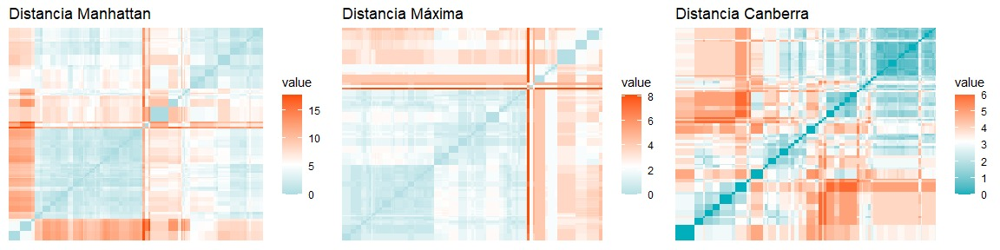
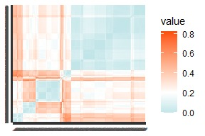

```{r setup, include=FALSE}
knitr::opts_chunk$set(echo = FALSE, warning = FALSE, message=FALSE)
```

```{r librerias}
library(readxl)
library(knitr)
library(cluster)
library(FactoMineR)
library(factoextra)
library(NbClust)
library(clValid)
library(grid)
library(gridExtra)
library(ggsci)

```


```{r datos, include=FALSE}
fotocasa = read_excel("fotocasaImp.xlsx")

columnas= colnames(fotocasa)
# Definir las variables de confort
confort = c("tieneAscensor", "tieneTrastero", "tieneCalefacción", "tieneAireAcondicionado", "bathrooms", "surface", "rooms"
)
# Identificar automáticamente las variables de servicios (aquellas que terminan en "_count")
servicios = grep("_count$", columnas, value = TRUE)
# Crear el data.frame de flags
tabla <- data.frame(
  Variable   = columnas,
  Confort    = as.integer(columnas %in% confort),
  Servicios  = as.integer(columnas %in% servicios),
  stringsAsFactors = FALSE
)
fotocasaServicios = fotocasa[,tabla$Servicios == 1]
fotocasaServiciosCE = scale(fotocasaServicios, center = TRUE, scale = TRUE)
```


**ANEXO CLUSTERING**

**Clustering de Servicios**

*Prueba de distancias*

A continuación, se muestran los resultados obtenidos con distintas métricas de distancias que fueron evaluadas pero finalmente descartadas en favor de la distancia euclídea, por ofrecer menor cohesión entre grupos o menor interpretabilidad. 

```{r heatmap_distancias_comparadas, out.width="80%", fig.align='center'}
library(factoextra)
library(gridExtra)

# Calcular distancias alternativas
#midist_manhattan <- get_dist(fotocasaServiciosCE, stand = FALSE, method = "manhattan")
#midist_max       <- get_dist(fotocasaServiciosCE, stand = FALSE, method = "maximum")
#midist_canberra  <- get_dist(fotocasaServiciosCE, stand = FALSE, method = "canberra")

# Crear cada gráfico
#p1 <- fviz_dist(midist_manhattan, show_labels = FALSE, lab_size = 0.3,
#                gradient = list(low = "#00AFBB", mid = "white", high = "#FC4E07")) +
 # ggtitle("Distancia Manhattan")

#p2 <- fviz_dist(midist_max, show_labels = FALSE, lab_size = 0.3,
             #   gradient = list(low = "#00AFBB", mid = "white", high = "#FC4E07")) +
 # ggtitle("Distancia Máxima")

#p3 <- fviz_dist(midist_canberra, show_labels = FALSE, lab_size = 0.3,
       #         gradient = list(low = "#00AFBB", mid = "white", high = "#FC4E07")) +
#  ggtitle("Distancia Canberra")

# Mostrar los tres juntos
#grid.arrange(p1, p2, p3, nrow = 1)


midist_eu <- get_dist(fotocasaServiciosCE, stand = FALSE, method = "euclidean")

```


*Selección de la técnica de agrupación y del número de clusters*

  -Método jerárquico de WARD
En este caso, seleccionamos el resultado con **8 clusters**. Se trataba de la organización con mayor coeficiente de Silhouette, además de una suma de cuadrados residual muy reducida. 

```{r serv_metodoWard, fig.align='center', fig.height=3, fig.width=6}
library(grid)
library(gridExtra)
p1 = fviz_nbclust(x = fotocasaServiciosCE, FUNcluster = hcut, diss=midist_eu,
                  hc_method = "ward.D2", k.max = 10, verbose = FALSE,
                  hc_metric = "euclidean") + labs(title = "Num. optimo clusters")
p2 = fviz_nbclust(x = fotocasaServiciosCE, FUNcluster = hcut, method = "wss",
                  hc_method = "ward.D2", k.max = 10, verbose = FALSE,diss=midist_eu,
                  hc_metric = "euclidean") + labs(title = "Num. optimo clusters")
grid.arrange(p1, p2, nrow = 1)
```
  -Método de partición PAM
  
A través de la técnica PAM (k-medioides), obteníamos el máximo coeficiente y el mínimo SCR con 10 clusters. Sin embargo, la partición en **8 grupos** reducíamos la complejidad del análisis con índices de calidad muy similares.

```{r serv_pam, fig.align='center', fig.height=2, fig.width=6}
p1 = fviz_nbclust(x = fotocasaServiciosCE, FUNcluster = pam, method = "silhouette",
             k.max = 10, verbose = FALSE) +
  labs(title = "Numero optimo de clusters")
p2 = fviz_nbclust(x = fotocasaServiciosCE, FUNcluster = pam, method = "wss",
             k.max = 10, verbose = FALSE) +
  labs(title = "Numero optimo de clusters")
grid.arrange(p1, p2, nrow = 1)
```

  -Método de partición k-medias
  
Finalmente, con k-medias se maximizaba el coeficiente de Silhouette dividiendo los pisos en 3 grupos. No obstante, la SCR era todavía excesivamente elevada. La opción que mejor combinaba ambos parámetros era **k=7**.

```{r k_medias, fig.align='center', fig.height=2, fig.width=6}
p1 = fviz_nbclust(x = fotocasaServiciosCE, FUNcluster = kmeans, method = "silhouette",
             k.max = 10, verbose = FALSE) +
  labs(title = "Numero optimo de clusters")
p2 = fviz_nbclust(x = fotocasaServiciosCE, FUNcluster = kmeans, method = "wss",
             k.max = 10, verbose = FALSE) +
  labs(title = "Numero optimo de clusters")
grid.arrange(p1, p2, nrow = 1)
```
Una vez decidido el número de divisiones en cada método, comparamos los clusters resultantes. Vimos que, aunque los resultados eran similares, las **particiones de k-medias** contenían generalmente menos inmuebles mal clasificados.

```{r comparacion, fig.align='center', fig.height=4, fig.width=8}
clustWARD <- hclust(midist_eu, method="ward.D2")
gruposWARD <- cutree(clustWARD, k=6)
clustPAM <- pam(midist_eu, k=8, diss=TRUE)
set.seed(100)
clustMEANS <- kmeans(fotocasaServiciosCE, centers = 7, nstart = 20)
colores = pal_npg("nrc")(6)
colores2 = pal_npg("nrc")(8)
colores3=pal_npg("nrc")(7)
par(mfrow = c(1,3))
plot(silhouette(gruposWARD, midist_eu), col=colores, border=NA, main = "WARD")
plot(silhouette(clustPAM$clustering, midist_eu), col=colores2, border=NA, main = "K-MEDIOIDES")
plot(silhouette(clustMEANS$cluster, midist_eu), col=colores3, border=NA, main = "K-MEDIAS")

```

**Clustering de Confort**

```{r confort}
fotocasaConfort = fotocasa[,tabla$Confort == 1]
fotocasaConfortCE = scale(fotocasaConfort, center = TRUE, scale = TRUE)
```

*Distancias y selección del método de agrupación*
Dado que el conjunto que describe las comodidades ofrecidas por cada piso contiene tanto variables categóricas como numéricas, únicamente podíamos consultar las tendencias de agrupamiento con la distancia de Gower.

```{r heatmap_confort_gower, fig.align='center',out.width="50%"}
midist_gower <- gower_dist <- daisy(fotocasaConfortCE, metric = "gower")
#fviz_dist(midist_gower, show_labels = TRUE, lab_size = 0.3,
#          gradient = list(low = "#00AFBB", mid = "white", high = "#FC4E07"))


```

En el mapa de calor encontramos evidencias de la existencia de subgrupos en el conjunto de datos. Con el objetivo de detectar dichos clusters e interpretarlos, comenzamos el análisis probando las técnicas de Ward y k-medioides para determinar cuál generaba resultados más definidos. No aplicamos k-medias porque no habíamos utilizado la distancia euclídea.

  - Método de WARD (k=5)
```{r confort_metodoWard, fig.align='center', fig.height=2, fig.width=6}
library(grid)
library(gridExtra)
p1 = fviz_nbclust(x = fotocasaConfortCE, FUNcluster = hcut, diss=midist_gower,
                  hc_method = "ward.D2", k.max = 10, verbose = FALSE) + labs(title = "Num. optimo clusters")
p2 = fviz_nbclust(x = fotocasaConfortCE, FUNcluster = hcut, method = "wss",
                  hc_method = "ward.D2", k.max = 10, verbose = FALSE,diss=midist_gower) + labs(title = "Num. optimo clusters")
grid.arrange(p1, p2, nrow = 1)
```

  -Método PAM (k=6)

```{r confort_pam, fig.align='center', fig.height=2, fig.width=6}
p1 = fviz_nbclust(x = fotocasaConfortCE, FUNcluster = pam, method = "silhouette",
             k.max = 10, verbose = FALSE, diss=midist_gower) +
  labs(title = "Numero optimo de clusters")
p2 = fviz_nbclust(x = fotocasaConfortCE, FUNcluster = pam, method = "wss",
             k.max = 10, verbose = FALSE, diss=midist_gower) +
  labs(title = "Numero optimo de clusters")
grid.arrange(p1, p2, nrow = 1)  
```
Finalmente, nos decantamos por el método *Ward* porque su coeficiente medio de Silhouette era notablemente superior.
```{r seleccionar_clustering, fig.align='center', fig.width=8, fig.height=4}
clustWARD <- hclust(midist_gower, method="ward.D2")
gruposWARD <- cutree(clustWARD, k=5)
clustPAM <- pam(midist_gower, k =6, diss=TRUE)
library(ggsci)
colores = pal_npg("nrc")(5)
colores2 = pal_npg("nrc")(6)
par(mfrow = c(1,2))
plot(silhouette(gruposWARD, midist_gower), col=colores, border=NA, main = "WARD")
plot(silhouette(clustPAM$clustering, midist_gower), col=colores2, border=NA, main = "K-MEDIOIDES")
fotocasaConfort$clusterConf=factor(gruposWARD)
```

*Análisis de Componentes Principales*

Se realizó un PCA de 2 componentes (casi el 60% de la variabilidad) para comprender mejor las características de cada Cluster. 
```{r pca_confort, fig.align='center', fig.height=2.8, fig.width=4}
fotocasaConfort$priceAmount=fotocasa$priceAmount
miPCA = PCA(fotocasaConfort, scale.unit = TRUE, graph = FALSE, ncp=2, quanti.sup="priceAmount", quali.sup="clusterConf")
eig.val = get_eigenvalue(miPCA)
Vmedia = 100 * (1/nrow(eig.val))
fviz_eig(miPCA, addlabels = TRUE) +
  geom_hline(yintercept=Vmedia, linetype=2, color="red")
```
  - Primera componente *(Tamaño útil)*: mayor superficie, más habitaciones y baños (tamaño del piso), positivamente relacionado con el precio. Los clusters se reparten de forma relativamente uniforme, aunque el grupo 1 tiene más viviendas con valores altos en esta variable latente.
  - Segunda componente *(Equipamiento interior)*: más pisos con aire acondicionado, calefacción, ascensor... Entre otras infraestructuras que aportan valor añadido a la vivienda. En esta dimensión hay una segmentación más clara de los clusters. El cluster 2 destaca positivamente, seguido del 1. Los clusters 4 y 5 son los que peores condiciones ofrecen. 
```{r pca_confort_GRAFICOS, fig.align='center', fig.height=3, fig.width=7}
p1=fviz_pca_ind(miPCA,
             geom = "point",
             habillage = "clusterConf",
             palette = "jco",
             addEllipses = TRUE,        # para ver la nube de cada grupo
             title = "Individuos por grupo (con elipses)")
p2 <- fviz_pca_var(miPCA,
                   col.var = "contrib", # Color según contribución a los ejes
                   gradient.cols = c("#00AFBB", "#E7B800", "#FC4E07"),
                   repel = TRUE,
                   title = "Loading plot: variables")
# Mostrar ambos juntos
grid.arrange(p1, p2, nrow = 1)

```

```{r mediasServicios, fig.align='center', fig.height=2.2, fig.width=6}
library(gridExtra)
library(grid)
library(ggplot2)

price_por_cluster <- aggregate(priceAmount ~ fotocasaConfort$clusterConf, data = fotocasa, mean)
colnames(price_por_cluster) <- c("Clúster", "Precio medio (€)")
rownames(price_por_cluster) <- NULL
tabla_grob <- tableGrob(price_por_cluster, rows = NULL)

# Cambiar el tamaño de letra en todas las celdas
tabla_grob$grobs <- lapply(tabla_grob$grobs, function(g) {
  if ("text" %in% class(g)) {
    g$gp <- gpar(fontsize = 8)  # Aquí ajustas el tamaño
  }
  g
})

# Crear boxplot con ggplot
df <- data.frame(cluster = factor(fotocasaConfort$clusterConf), price = fotocasa$priceAmount)
boxplot_grob <- ggplot(df, aes(x = cluster, y = price)) +
  geom_boxplot(fill = "lightblue") +
  ylim(0, 5000) +
  labs(title = "Distribución del precio por clúster", 
       x = "Clúster", 
       y = "Precio (€)") +
  theme_minimal() +
  theme(plot.title = element_text(size = 8))  # Ajusta aquí el tamaño del título

# Mostrar ambos juntos
grid.arrange(tabla_grob, boxplot_grob, ncol = 2)

```
Si comparamos el precio medio de cada cluster, vemos el orden es casi idéntico a la estructura que siguen a lo largo de la segunda componente; únicamente se intercambian los clusters 3 y 4, que a su vez son los que tienen un promedio más parecido. Por lo tanto, podríamos considerar el cluster como una variable ordinal que nos indica el la categoría de cada vivienda (muy relacionada con su precio). Esta división no coincide estrictamente con el tamaño de la vivienda, sino que está más basada en sus condiciones de habitabilidad.
Los niveles serían los siguientes:

```{r niveles_calidad, fig.align='center', fig.height=1.5, fig.width=6}

library(knitr)

tabla_equivalencia <- data.frame(
  Nivel = 1:4,
  Calidad = c("Baja", "Media", "Alta", "Lujo"),
  Clusters_originales = c("5", "3-4", "1", "2")
)

kable(tabla_equivalencia, caption = "Correspondencia entre nivel de calidad y clústers")

```
A continuación, se muestran las frecuencias de pisos en cada una de las nuevas cateorías.
```{r guardar_resul, fig.align='center', fig.width=4, fig.height=2}
library(dplyr)
fotocasa$clusterConf=factor(fotocasaConfort$clusterConf)
fotocasa <- fotocasa %>%
  mutate(categoria = case_when(
    clusterConf == 5 ~ "Baja",
    clusterConf == 3 ~ "Media",
    clusterConf == 4 ~ "Media",
    clusterConf == 1 ~ "Alta",
    clusterConf == 2 ~ "Lujo"
  ))

fotocasa$categoria <- factor(fotocasa$categoria,
                             levels = c("Baja", "Media", "Alta", "Lujo"))

# Ahora vuelve a generar el gráfico (se verá ordenado)
ggplot(fotocasa, aes(x = categoria)) +
  geom_bar(fill = "#69b3a2") +
  labs(title = "Frecuencia por categoría de confort",
       x = "Categoría",
       y = "Frecuencia") +
  theme_minimal()

```


