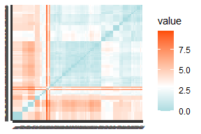
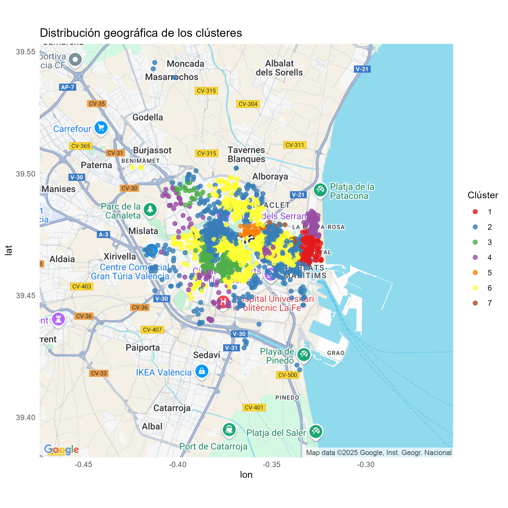

```{r setup, include=FALSE}
knitr::opts_chunk$set(echo = FALSE, warning=FALSE, message = FALSE)
library(knitr)
library(cluster)
library(FactoMineR)
library(factoextra)
library(NbClust)
library(clValid)
library(grid)
library(gridExtra)
library(ggsci)

```

Con el objetivo de identificar patrones relevantes dentro de la base de datos, se han planteado dos análisis de clustering independientes. Esta técnica de aprendizaje no supervisado permite agrupar inmuebles en función de sus similitudes, sin necesidad de una variable respuesta.
Para comenzar la exploración, seleccionamos dos grupos de variables para construir nuestros nuevos conjuntos:
  Clustering de Confort (dimensión interna), enfocado en las condiciones de comodidad y habitabilidad que ofrece la propia vivienda.
  Clustering de Servicios (dimensión externa), refleja la calidad, accesibilidad y otras características del entorno urbano del inmueble.
  
```{r tabla, results='asis', fig.align='center'}
library(readxl)
fotocasa = read_excel("fotocasaImp.xlsx")
# Vector con nombres de todas las columnas
columnas= colnames(fotocasa)
# Definir las variables de confort
confort = c("tieneAscensor", "tieneTrastero", "tieneCalefaccion", "tieneAireAcondicionado", "bathrooms", "surface", "rooms"
)
# Identificar automáticamente las variables de servicios (aquellas que terminan en "_count")
servicios=c(grep("_count$", columnas, value = TRUE))
# Crear el data.frame de flags
tabla <- data.frame(
  Variable   = columnas,
  Confort    = as.integer(columnas %in% confort),
  Servicios  = as.integer(columnas %in% servicios),
  stringsAsFactors = FALSE
)
# Mostrar resultado
# Filtrar la tabla para conservar solo las filas con al menos un 1 en Confort o Servicios
tabla_filtrada <- tabla[rowSums(tabla[, c("Confort", "Servicios")]) > 0, ]
# Mostrar resultado
library(xtable)
# Luego imprimir con xtable (permitiendo LaTeX en encabezados)
print(xtable(tabla_filtrada), 
      type = "latex", 
      comment = FALSE,  
      include.rownames = FALSE,
      sanitize.colnames.function = identity)

```
Sin embargo, debido a limitaciones de espacio, en la memoria principal se ha optado por incluir únicamente el clustering basado en los servicios de la ubicación. Hemos priorizado esta división antes que la de confort y comodidad porque consideramos que sus resultados muestran una estructura de agrupamiento más clara y relevante. Además, la clasificación solventa uno de los problemas de la base de datos original: el exceso de barrios y municipios que no permitía un análisis correcto del entorno urbano.
Así pues, dado que las conclusiones de esta fase del proyecto serán incorporados en estudios posteriores; creemos que su inclusión en la memoria final es imprescindible.
No obstante, la clasificación en función del confort está disponible en el anexo de CLUSTERING; en caso de que se quiera consultar.

***CLUSTERING DE SERVICIOS DEL ENTORNO***

El paso previo a la clasificación fue comprobar si existían tendencias de agrupación en los pisos basándonos en las variables del cluster. Para ello, elaboramos un *heatmap*. Dado que pretendíamos identificar similitudes entre las infraestructuras ofrecidas por cada ubicación, consideramos adecuado aplicar una medida de cercanía.
Probamos todas las distancias para variables numéricas disponibles y, finalmente, obtuvimos una tendencia de agrupación más compacta con la euclídea.
En el mapa resultante, se observan ciertos subgrupos alrededor de la diagonal principal; aunque sería necesario efectuar el clustering para identificar estructuras más claras.
\begin{footnotesize}
*(Antes de generar el mapa, se escaló y centró el conjunto de datos sobre el que realizaríamos el análisis. Esto evita sesgos en el cálculo de las distancias y mejora la calidad de los agrupamientos).*
\end{footnotesize}


.
```{r heatmap, fig.align='center', out.width="50%"}
fotocasaServicios = fotocasa[,tabla$Servicios == 1]
fotocasaServiciosCE = scale(fotocasaServicios, center = TRUE, scale = TRUE)
midist_eu <- get_dist(fotocasaServiciosCE, stand = FALSE, method = "euclidean")
#fviz_dist(midist_eu, show_labels = TRUE, lab_size = 0.3,
          #gradient = list(low = "#00AFBB", mid = "white", high = "#FC4E07"))



```

Como punto de partida, iniciamos el análisis probando varias técnicas de agrupamiento: el método jerárquico de Ward y los de partición k-medias y k-medioides. En los tres casos, analizamos simultáneamente la suma de cuadrados residual y el coeficiente de Silhouette para determinar el número óptimo de subgrupos.
Así, seleccionamos k=6 con Ward; k=8 mediante PAM y k=7 aplicando k-medias.
Una vez divididos los datos, comparamos el coeficiente medio de Silhouette y vimos que, en los grupos obtenidos a partir de las medias, la mayoría de los grupos estaban mejor definidos. Por ello, nos decantamos por los 7 clusters.
Los gráficos relativos a la selección del método de agrupación no se han incluido en la memoria final, pero se pueden consultar en el anexo de CLUSTERING.

```{r k_medias, include=FALSE}
p1 = fviz_nbclust(x = fotocasaServiciosCE, FUNcluster = kmeans, method = "silhouette",
             k.max = 10, verbose = FALSE) +
  labs(title = "Numero optimo de clusters")
p2 = fviz_nbclust(x = fotocasaServiciosCE, FUNcluster = kmeans, method = "wss",
             k.max = 10, verbose = FALSE) +
  labs(title = "Numero optimo de clusters")
grid.arrange(p1, p2, nrow = 1)
```

```{r comparacion, include=FALSE}
clustWARD <- hclust(midist_eu, method="ward.D2")
gruposWARD <- cutree(clustWARD, k=6)
clustPAM <- pam(midist_eu, k =8, diss=TRUE)
set.seed(100)
clustMEANS <- kmeans(fotocasaServiciosCE, centers = 7, nstart = 20)
colores = pal_npg("nrc")(6)
colores2 = pal_npg("nrc")(8)
colores3=pal_npg("nrc")(7)
par(mfrow = c(1,3))
plot(silhouette(gruposWARD, midist_eu), col=colores, border=NA, main = "WARD")
plot(silhouette(clustPAM$clustering, midist_eu), col=colores2, border=NA, main = "K-MEDIOIDES")
plot(silhouette(clustMEANS$cluster, midist_eu), col=colores3, border=NA, main = "K-MEDIAS")
fotocasaServiciosCE$cluster=clustMEANS$cluster

```

A continuación, estudiamos qué variables habían tenido más peso en la nueva clasificación a través de un Análisis de Componentes Principales con 2 dimensiones (con las cuales se explica el 65% de la variabilidad total). Asimismo, utilizamos las columnas cluster y priceAmount como auxiliares para entender su relación con el resto de variables consideradas.

```{r fig.align='center', include=FALSE}
fotocasaServicios$cluster <- factor(clustMEANS$cluster)
fotocasaServicios$priceAmount <- fotocasa$priceAmount

miPCA2 = PCA(fotocasaServicios, scale.unit = TRUE, graph = FALSE, ncp=2, quanti.sup="priceAmount", quali.sup="cluster")
eig.val = get_eigenvalue(miPCA2)
Vmedia = 100 * (1/nrow(eig.val))
fviz_eig(miPCA2, addlabels = TRUE) +
  geom_hline(yintercept=Vmedia, linetype=2, color="red")
```

Al estudiar el score plot, identificamos siete grupos claramente diferenciados. Destacan especialmente los clusters 7 y 1, tan compactos que apenas se distinguen uno o dos individuos. Incluso en las divisiones más dispersas (3 y 4) sus puntos se encuentran bastante próximos.
Por otra parte, en el loading plot observamos que la primera componente está positivamente relacionada con la cantidad de farmacias, colegios, supermercados y conexiones de transporte. En cambio, la segunda depende de los hospitales y universidades. No parece que el precio del piso tenga una gran importancia en esta clasificación.
Paralelamente, si superponemos ambos gráficos, parece que el cluster 3 sobresale por estar notablemente mejor comunicado que el resto de grupos. Por el contrario, el cluster 2 es aparentemente el peor ubicado.
```{r pcaPLOTS, fig.align='center', fig.height=3, fig.width=7}
p1 <- fviz_pca_ind(miPCA2,
                   geom = "point",
                   habillage = fotocasaServicios$cluster,
                   palette = "jco",
                   title = "Score plot: individuos")
# Loading plot (variables activas)
p2 <- fviz_pca_var(miPCA2,
                   col.var = "contrib", # Color según contribución a los ejes,
                   col.quanti.sup = 'black',
                   gradient.cols = c("#00AFBB", "#E7B800", "#FC4E07"),
                   repel = TRUE,
                   title = "Loading plot: variables")
# Mostrar ambos juntos
grid.arrange(p1, p2, nrow = 1)
```
Para comparar los precios de cada cluster, calculamos sus medias y representamos las 7 distribuciones mediante sus respectivos gráficos de caja y bigotes. Tal como habíamos supuesto al examinar el PCA, no encontramos una diferencia muy acusada entre los precios medios. No obstante, resulta sorprendente que el cluster 2, que habiamos resaltado como el peor ubicado, es el más caro en promedio. Este importe elevado seguramente se deba a los pisos atípicos detectados en su *box&whiskers*, los cuales podrían estar mal clasificados o reflejar una ubicación segmentada internamente entre viviendas básicas y otras más exclusivas.
El tercer cluster tiene un precio muy similar, aunque con menos pisos atípicos, por lo que seguramente sus viviendas presenten buena comunicación general.

```{r mediasServicios, fig.align='center', fig.height=2.2, fig.width=6}
library(gridExtra)
library(grid)
library(ggplot2)

price_por_cluster <- aggregate(priceAmount ~ fotocasaServicios$cluster, data = fotocasa, mean)
colnames(price_por_cluster) <- c("Clúster", "Precio medio (€)")
rownames(price_por_cluster) <- NULL
tabla_grob <- tableGrob(price_por_cluster, rows = NULL)

# Cambiar el tamaño de letra en todas las celdas
tabla_grob$grobs <- lapply(tabla_grob$grobs, function(g) {
  if ("text" %in% class(g)) {
    g$gp <- gpar(fontsize = 8)  # Aquí ajustas el tamaño
  }
  g
})

# Crear boxplot con ggplot
df <- data.frame(cluster = factor(fotocasaServicios$cluster), price = fotocasa$priceAmount)
boxplot_grob <- ggplot(df, aes(x = cluster, y = price)) +
  geom_boxplot(fill = "lightblue") +
  ylim(0, 5000) +
  labs(title = "Distribución del precio por clúster", 
       x = "Clúster", 
       y = "Precio (€)") +
  theme_minimal() +
  theme(plot.title = element_text(size = 8))  # Ajusta aquí el tamaño del título

# Mostrar ambos juntos
grid.arrange(tabla_grob, boxplot_grob, ncol = 2)

```

Finalmente, para visualizar geográficamente los resultados obtenidos, hemos los 7 clusters en un mapa de la ciudad de Valencia, utilizando las variables latitud y longitud. Así, fue posible determinar a qué zona corresponde cada uno de los grupos.
La representación del mapa la conseguimos a partir de una API KEY de google cloud y, por motivos de seguridad, en esta memoria se incluirá en formato png. En la imagen se aprecia como, mientras algunos clusters están muy centrados en una zona concreta, otros se extienden por varios barrios valencianos.

```{r mapa_clusters, fig.align='center', out.width="0.5\\linewidth"}

```
A partir de la información obtenida en el mapa, hemos diseñado la siguiente clasificación:

```{r clasificacion_final, fig.align='center', fig.height=1.8, fig.width=7}
library(dplyr)
library(ggplot2)

# Datos base
clasificacion <- data.frame(
  Cluster = paste("Clúster", 1:7),
  Zona = c(
    "Poblats Marítims",
    "Centro histórico, pedanías y zona universitaria",
    "Ruzafa, Jesús y Benicalap",
    "Periferia",
    "Aragón, Blasco Ibáñez",
    "Gran Vía, Colón y zona universitaria",
    "Tarongers"
  ),
  Color = c("#E41A1C", "#377EB8", "#4DAF4A", "#984EA3", "#FF7F00", "#FFFF33", "#A65628")
)

# Extraer número de clúster para ordenar
clasificacion$Num <- as.numeric(gsub("[^0-9]", "", clasificacion$Cluster))

# Ordenar por número de clúster
clasificacion <- clasificacion[order(clasificacion$Num), ]

# Crear gráfico con orden correcto
ggplot(clasificacion, aes(x = 1, y = factor(Zona, levels = rev(Zona)), fill = Cluster)) +
  geom_tile(width = 0.8, height = 0.8, show.legend = FALSE) +
  geom_text(aes(label = Cluster), color = "white", fontface = "bold", size = 4) +
  geom_text(aes(x = 2, label = Zona), color = "black", hjust = 0, size = 4) +
  scale_fill_manual(values = clasificacion$Color) +
  theme_void() +
  coord_cartesian(clip = "off") +
  xlim(0.5, 3.5)

```
En este punto, podemos aplicar las conclusiones extraídas del análisis a zonas reales y conocidas de nuestra ciudad. Por ejemplo, las zonas mejor ubicadas y con mejores prestaciones serían Ruzafa, Jesús y Benicalap. Paralelamente, entre el Centro histórico, pedanías y parte zona universitaria encontramos una ecléctica gama de viviendas, unas pocas  más exclusivas y la mayoría restante con comunicaciones bastante mejorables (posiblemente las ubicadas en las afueras de la ciudad). Los clusters 5 y 7, que en el PCA aparecían altamente relacionados con la variable *university_count* se corresponden con los sectores de Aragón, Blasco y Tarongers.
En conjunto, los resultados del clustering muestran una segmentación coherente con la estructura urbana y social de la ciudad, reflejando patrones territoriales que se corresponden con zonas reales y reconocibles. Esta clasificación no solo valida la calidad del análisis, sino que también permite incorporar de forma explícita la dimensión del entorno como variable explicativa en análisis posteriores; mejorando así nuestro entendimiento del mercado inmobiliario valenciano.


```{r adjuntar_cluster}
# Supón que quieres copiar la columna "mi_columna" del dataframe df1
write.csv(fotocasaServicios["cluster"], "cluster.csv", row.names = FALSE)

```

